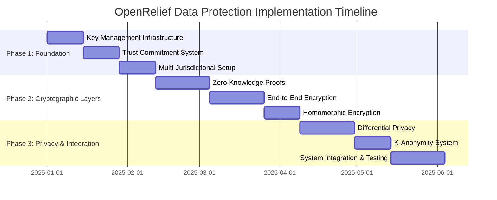

# OpenRelief Data Protection Architecture: Implementation Roadmap

## Executive Summary

This roadmap provides a detailed 6-month implementation plan for OpenRelief's comprehensive data protection architecture, prioritizing zero-knowledge trust systems and cryptographic protections within limited budget constraints. The plan is structured in three phases with clear milestones, dependencies, and resource allocations.

## Implementation Timeline Overview

## Phase 1: Zero-Knowledge Trust Foundation (Months 1-2)

### Month 1: Core Cryptographic Infrastructure

#### Week 1-2: Key Management System
**Timeline**: January 1-14, 2025
**Priority**: Critical
**Budget**: $15,000

**Tasks**:
1. **HSM Integration Setup**
   - Configure AWS CloudHSM or Azure Dedicated HSM
   - Implement key generation and rotation procedures
   - Set up multi-region key replication
   - **Deliverable**: Operational HSM key management system

2. **User Key Pair Generation**
   - Implement X25519 key pair generation
   - Create secure key storage mechanisms
   - Develop key backup and recovery procedures
   - **Deliverable**: User key management service

3. **Ephemeral Key Management**
   - Implement perfect forward secrecy mechanisms
   - Create key exchange protocols
   - Set up key lifecycle management
   - **Deliverable**: Ephemeral key service

**Acceptance Criteria**:
- HSM integration completed with FIPS 140-2 Level 3 compliance
- User keys generated and stored securely
- Ephemeral keys rotate every hour with perfect forward secrecy
- Key recovery procedures tested and documented

#### Week 3-4: Trust Commitment System
**Timeline**: January 15-28, 2025
**Priority**: Critical
**Budget**: $20,000

**Tasks**:
1. **Trust Factor Hashing**
   - Implement SHA-256 commitment hashing
   - Create salt generation and management
   - Develop commitment verification algorithms
   - **Deliverable**: Trust commitment engine

2. **Cryptographic Commitments**
   - Implement commitment scheme with binding property
   - Create commitment verification protocols
   - Develop commitment revocation mechanisms
   - **Deliverable**: Commitment verification system

3. **Trust History Management**
   - Design encrypted trust history storage
   - Implement commitment-based history tracking
   - Create trust factor calculation APIs
   - **Deliverable**: Trust history service

**Acceptance Criteria**:
- Trust commitments generated in < 100ms
- Commitment verification completed in < 50ms
- Trust history stored without revealing actual scores
- Commitment scheme cryptographically secure and binding

### Month 2: Distributed Trust Storage

#### Week 5-6: Multi-Jurisdictional Infrastructure
**Timeline**: January 29 - February 11, 2025
**Priority**: Critical
**Budget**: $25,000

**Tasks**:
1. **Jurisdictional Node Setup**
   - Deploy nodes in EU (Frankfurt), CH (Zurich), SG (Singapore)
   - Configure jurisdiction-specific compliance rules
   - Implement data residency controls
   - **Deliverable**: Multi-jurisdictional infrastructure

2. **Secret Sharing Implementation**
   - Implement Shamir's Secret Sharing (3-of-5)
   - Create share distribution mechanisms
   - Develop share reconstruction algorithms
   - **Deliverable**: Secret sharing service

3. **Cross-Jurisdiction Data Transfer**
   - Implement secure transfer protocols
   - Create compliance checking mechanisms
   - Develop transfer audit logging
   - **Deliverable**: Secure data transfer system

**Acceptance Criteria**:
- Nodes operational in 3+ jurisdictions
- Secret sharing with 3-of-5 threshold reconstruction
- Data transfers comply with local regulations
- Audit trails for all cross-border data movements

## Phase 2: Cryptographic Protection Layers (Months 3-4)

### Month 3: Zero-Knowledge Proofs & Advanced Encryption

#### Week 7-9: Zero-Knowledge Proof System
**Timeline**: February 12 - March 4, 2025
**Priority**: Critical
**Budget**: $35,000

**Tasks**:
1. **zk-SNARK Circuit Development**
   - Design trust threshold verification circuit
   - Implement circuit in Circom or similar
   - Perform trusted setup ceremony
   - **Deliverable**: zk-SNARK trust circuit

2. **Proof Generation Service**
   - Implement Groth16 proof generation
   - Create proof verification algorithms
   - Optimize for mobile performance
   - **Deliverable**: ZK proof service

3. **Anonymous Authentication**
   - Implement zero-knowledge identity proofs
   - Create anonymous credential system
   - Develop privacy-preserving verification
   - **Deliverable**: Anonymous authentication system

**Acceptance Criteria**:
- zk-SNARK proofs generated in < 200ms on mobile
- Proof verification completed in < 10ms
- Anonymous authentication without identity revelation
- Trusted setup completed with MPC ceremony

#### Week 10-12: End-to-End Encryption
**Timeline**: March 5-25, 2025
**Priority**: High
**Budget**: $25,000

**Tasks**:
1. **E2E Encryption Implementation**
   - Implement AES-256-GCM encryption
   - Create key derivation with HKDF
   - Develop secure key exchange protocols
   - **Deliverable**: E2E encryption service

2. **Perfect Forward Secrecy**
   - Implement ephemeral key rotation
   - Create session key management
   - Develop key compromise recovery
   - **Deliverable**: Forward secrecy system

3. **Data Encryption at Rest**
   - Implement database encryption
   - Create secure backup procedures
   - Develop encryption key rotation
   - **Deliverable**: Encrypted storage system

**Acceptance Criteria**:
- End-to-end encryption for all sensitive data
- Perfect forward secrecy with 1-hour key rotation
- Data encrypted at rest with user-controlled keys
- Key rotation without service interruption

### Month 4: Homomorphic Encryption & Trust Calculations

#### Week 13-15: Homomorphic Encryption
**Timeline**: March 26 - April 15, 2025
**Priority**: High
**Budget**: $30,000

**Tasks**:
1. **BFV Scheme Implementation**
   - Integrate Microsoft SEAL or similar library
   - Implement encrypted arithmetic operations
   - Create parameter optimization
   - **Deliverable**: Homomorphic encryption service

2. **Encrypted Trust Calculations**
   - Implement trust score calculation on encrypted data
   - Create weighted voting with encryption
   - Develop consensus mechanisms
   - **Deliverable**: Encrypted trust calculation

3. **Performance Optimization**
   - Optimize for mobile devices
   - Implement batch processing
   - Create caching mechanisms
   - **Deliverable**: Optimized HE service

**Acceptance Criteria**:
- Homomorphic operations complete in < 100ms
- Trust calculations performed without decrypting inputs
- Batch processing for improved performance
- Mobile-compatible implementation

## Phase 3: Privacy Systems & Integration (Months 5-6)

### Month 5: Privacy-Preserving Mechanisms

#### Week 16-18: Differential Privacy
**Timeline**: April 16 - May 6, 2025
**Priority**: High
**Budget**: $20,000

**Tasks**:
1. **Laplace Mechanism Implementation**
   - Implement Laplace noise addition
   - Create privacy budget management
   - Develop query sensitivity analysis
   - **Deliverable**: Differential privacy service

2. **Location Privacy**
   - Implement location perturbation
   - Create geospatial privacy zones
   - Develop adaptive privacy levels
   - **Deliverable**: Location privacy system

3. **Trust Score Privacy**
   - Add noise to trust score queries
   - Implement privacy budget tracking
   - Create privacy-preserving statistics
   - **Deliverable**: Private trust queries

**Acceptance Criteria**:
- Differential privacy with ε=1.0 for standard queries
- Location privacy with 100m minimum accuracy
- Privacy budget enforced per user
- Statistical utility preserved for emergency response

#### Week 19-20: K-Anonymity System
**Timeline**: May 7-20, 2025
**Priority**: Medium
**Budget**: $15,000

**Tasks**:
1. **Data Generalization**
   - Implement attribute generalization
   - Create hierarchy-based generalization
   - Develop generalization level selection
   - **Deliverable**: Data generalization service

2. **Anonymity Set Management**
   - Implement k-anonymity algorithms
   - Create anonymity set optimization
   - Develop diversity enforcement
   - **Deliverable**: K-anonymity processor

3. **Privacy Metrics**
   - Implement t-closeness and l-diversity
   - Create privacy-utility tradeoff analysis
   - Develop privacy monitoring
   - **Deliverable**: Privacy metrics system

**Acceptance Criteria**:
- K-anonymity with k=5 minimum
- Generalization hierarchies for all attributes
- Privacy metrics meeting thresholds
- Utility preserved for emergency coordination

### Month 6: System Integration & Testing

#### Week 21-23: System Integration
**Timeline**: May 21 - June 10, 2025
**Priority**: Critical
**Budget**: $25,000

**Tasks**:
1. **Component Integration**
   - Integrate all privacy components
   - Create unified API interfaces
   - Implement system orchestration
   - **Deliverable**: Integrated privacy system

2. **Client Application Updates**
   - Update mobile applications
   - Implement new cryptographic protocols
   - Create user interface for privacy settings
   - **Deliverable**: Updated client applications

3. **Backend Integration**
   - Update server-side components
   - Implement new authentication flows
   - Create administrative interfaces
   - **Deliverable**: Updated backend services

**Acceptance Criteria**:
- All components integrated and functional
- Client applications support new privacy features
- Backend services compatible with new architecture
- User privacy settings implemented

#### Week 24: Security Testing & Deployment
**Timeline**: June 11-24, 2025
**Priority**: Critical
**Budget**: $20,000

**Tasks**:
1. **Security Testing**
   - Conduct penetration testing
   - Perform cryptographic audits
   - Test for side-channel attacks
   - **Deliverable**: Security test report

2. **Performance Testing**
   - Load test with 50K+ concurrent users
   - Measure cryptographic operation performance
   - Test emergency response latency
   - **Deliverable**: Performance test report

3. **Production Deployment**
   - Deploy to production environment
   - Monitor system performance
   - Create incident response procedures
   - **Deliverable**: Production deployment

**Acceptance Criteria**:
- Security testing with no critical vulnerabilities
- Performance benchmarks met (sub-100ms alert dispatch)
- Production deployment successful
- Monitoring and alerting operational

## Resource Allocation

### Team Composition

#### Core Development Team (8 people)
- **Cryptographic Engineer** (1): ZK proofs, homomorphic encryption
- **Backend Developer** (2): API development, database integration
- **Frontend Developer** (2): Mobile apps, web interface
- **DevOps Engineer** (1): Infrastructure, deployment
- **Security Engineer** (1): Security testing, audits
- **Project Manager** (1): Coordination, timeline management

#### Supporting Team (4 people)
- **Legal Counsel** (1): Compliance, regulatory requirements
- **QA Engineer** (1): Testing, quality assurance
- **Technical Writer** (1): Documentation, user guides
- **UI/UX Designer** (1): Privacy interface design

### Budget Breakdown

#### Infrastructure Costs ($85,000)
- **HSM Services**: $15,000 (6 months)
- **Multi-Jurisdictional Hosting**: $40,000 (6 months)
- **Cryptographic Services**: $20,000 (6 months)
- **Monitoring & Logging**: $10,000 (6 months)

#### Development Costs ($180,000)
- **Personnel**: $150,000 (6 months)
- **Security Audits**: $20,000
- **Compliance Certification**: $10,000

#### Contingency Budget ($35,000)
- **Unexpected Challenges**: $20,000
- **Additional Resources**: $10,000
- **Extended Timeline**: $5,000

**Total Budget**: $300,000

## Risk Management

### Technical Risks

#### High-Risk Items
1. **Cryptographic Implementation Complexity**
   - **Risk**: ZK proof implementation may be more complex than expected
   - **Mitigation**: Use existing libraries, expert consultation
   - **Contingency**: Simplify trust verification initially

2. **Performance Bottlenecks**
   - **Risk**: Cryptographic operations may impact performance
   - **Mitigation**: Early performance testing, optimization
   - **Contingency**: Implement caching, batch processing

3. **Multi-Jurisdictional Compliance**
   - **Risk**: Regulatory requirements may be more complex
   - **Mitigation**: Legal consultation, compliance monitoring
   - **Contingency**: Focus on compliant jurisdictions first

#### Medium-Risk Items
1. **Integration Challenges**
   - **Risk**: Component integration may face compatibility issues
   - **Mitigation**: Early integration testing, API standardization
   - **Contingency**: Additional integration time

2. **User Adoption**
   - **Risk**: Users may resist privacy features
   - **Mitigation**: User education, gradual rollout
   - **Contingency**: Optional privacy features initially

### Project Risks

#### Timeline Risks
- **Scope Creep**: Additional features requested during development
  - **Mitigation**: Strict change control, feature prioritization
  - **Contingency**: Buffer time in each phase

- **Resource Availability**: Key team members unavailable
  - **Mitigation**: Cross-training, documentation
  - **Contingency**: Backup resources, contractor support

#### External Dependencies
- **Third-Party Services**: Changes to external APIs or services
  - **Mitigation**: API version locking, abstraction layers
  - **Contingency**: Alternative providers, in-house solutions

## Success Metrics

### Technical Metrics
- **Cryptographic Performance**: All operations within specified time limits
- **Security Compliance**: Zero critical vulnerabilities in penetration testing
- **System Availability**: 99.9% uptime for critical services
- **Privacy Protection**: Differential privacy guarantees maintained

### Business Metrics
- **User Adoption**: 80% of users enable privacy features
- **Emergency Response**: No degradation in response time
- **Regulatory Compliance**: Full compliance with target jurisdictions
- **Cost Efficiency**: Implementation within 10% of budget

### Quality Metrics
- **Code Quality**: >80% test coverage, <5 critical bugs
- **Documentation**: Complete technical and user documentation
- **User Satisfaction**: >4.5/5 rating for privacy features
- **Performance**: Sub-100ms alert dispatch latency

## Monitoring & Evaluation

### Progress Tracking
- **Weekly Progress Reports**: Team progress against milestones
- **Monthly Reviews**: Stakeholder evaluation and course correction
- **Phase Gates**: Formal reviews before phase transitions
- **Risk Assessment**: Ongoing risk identification and mitigation

### Quality Assurance
- **Code Reviews**: Peer review for all code changes
- **Automated Testing**: Continuous integration and deployment
- **Security Audits**: Regular security assessments
- **Performance Monitoring**: Real-time performance metrics

### Communication Plan
- **Stakeholder Updates**: Bi-weekly progress reports
- **Team Meetings**: Daily standups, weekly planning
- **Technical Reviews**: Monthly technical deep-dives
- **User Feedback**: Continuous user testing and feedback

## Conclusion

This implementation roadmap provides a structured approach to deploying OpenRelief's comprehensive data protection architecture within the 6-month timeline and budget constraints. The phased approach ensures that critical privacy protections are implemented early while maintaining system functionality and emergency response capabilities.

Key success factors include:
1. **Early Focus**: Prioritize zero-knowledge trust system and cryptographic foundations
2. **Risk Management**: Proactive identification and mitigation of technical and project risks
3. **Quality Assurance**: Comprehensive testing and security audits throughout development
4. **Stakeholder Engagement**: Regular communication and feedback loops
5. **Flexibility**: Ability to adapt to challenges and changing requirements

The roadmap balances technical complexity with practical implementation considerations, ensuring that OpenRelief can achieve its privacy and security goals while maintaining its core mission of effective emergency coordination.