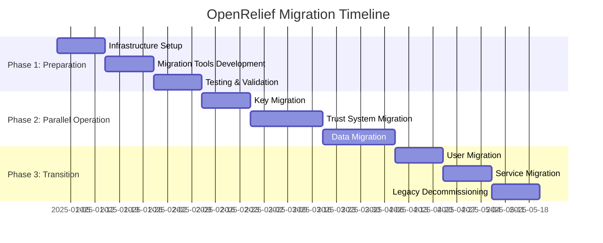

# OpenRelief Data Protection Architecture: Migration Strategy

## Executive Summary

This migration strategy provides a structured approach to transition OpenRelief from its current centralized architecture to a comprehensive data protection architecture with zero-knowledge trust systems and cryptographic protections. The strategy minimizes service disruption while ensuring data integrity and user privacy throughout the migration process.

## 1. Migration Overview

### 1.1 Migration Principles

#### Zero-Downtime Migration
- Maintain continuous emergency response capabilities
- Parallel operation of old and new systems
- Gradual user migration with fallback options
- Real-time synchronization between systems

#### Data Integrity Preservation
- Ensure no data loss during migration
- Maintain audit trail continuity
- Validate data integrity at each migration step
- Implement rollback capabilities for critical failures

#### Privacy by Design
- Apply privacy protections from migration start
- User consent for new privacy features
- Gradual introduction of enhanced privacy controls
- Transparent communication about changes

#### Risk Minimization
- Phased approach with clear rollback points
- Comprehensive testing before production deployment
- Monitoring and alerting throughout migration
- Contingency plans for each migration phase

### 1.2 Migration Timeline



## 2. Phase 1: Migration Preparation (Weeks 1-6)

### 2.1 Infrastructure Setup

#### Week 1-2: Multi-Jurisdictional Infrastructure
**Timeline**: January 1-14, 2025
**Priority**: Critical
**Dependencies**: None
**Budget**: $25,000

**Tasks**:
1. **Jurisdictional Node Deployment**
   - Deploy nodes in EU (Frankfurt), CH (Zurich), SG (Singapore)
   - Configure network connectivity and security
   - Set up monitoring and logging
   - **Deliverable**: Operational multi-jurisdictional infrastructure

2. **HSM Integration**
   - Configure AWS CloudHSM or Azure Dedicated HSM
   - Set up key management procedures
   - Implement backup and recovery
   - **Deliverable**: HSM key management system

3. **Database Setup**
   - Deploy PostgreSQL instances in each jurisdiction
   - Configure replication and consistency
   - Set up backup and recovery
   - **Deliverable**: Multi-jurisdictional database cluster

#### Week 3-4: Migration Tools Development
**Timeline**: January 15-28, 2025
**Priority**: Critical
**Dependencies**: Infrastructure Setup
**Budget**: $30,000

**Tasks**:
1. **Data Migration Tools**
   - Develop data extraction tools for current system
   - Create data transformation and validation utilities
   - Implement incremental migration capabilities
   - **Deliverable**: Data migration tool suite

2. **Synchronization Tools**
   - Develop real-time synchronization between systems
   - Create conflict resolution mechanisms
   - Implement monitoring and alerting
   - **Deliverable**: System synchronization tools

3. **Validation Tools**
   - Develop data integrity validation utilities
   - Create performance monitoring tools
   - Implement rollback testing capabilities
   - **Deliverable**: Migration validation suite

#### Week 5-6: Testing & Validation
**Timeline**: January 29 - February 11, 2025
**Priority**: Critical
**Dependencies**: Migration Tools
**Budget**: $20,000

**Tasks**:
1. **Migration Testing**
   - Test data migration with production-like data
   - Validate data integrity and consistency
   - Test rollback procedures
   - **Deliverable**: Migration test results

2. **Performance Testing**
   - Test migration performance with full load
   - Validate emergency response capabilities
   - Test system scalability
   - **Deliverable**: Performance test report

3. **Security Testing**
   - Test security of migration tools
   - Validate encryption and access controls
   - Test audit trail integrity
   - **Deliverable**: Security test results

### 2.2 User Communication & Consent

#### Consent Management Implementation
```typescript
class MigrationConsentManager {
  async requestMigrationConsent(
    userId: string,
    migrationDetails: MigrationDetails
  ): Promise<ConsentResult> {
    // Generate clear consent request
    const consentRequest = {
      userId,
      type: 'data-protection-migration',
      details: migrationDetails,
      privacyImpact: await this.assessPrivacyImpact(migrationDetails),
      benefits: await this.calculateMigrationBenefits(userId),
      timeline: migrationDetails.timeline,
      alternatives: ['stay-with-current-system', 'delay-migration']
    };

    // Send consent request
    await this.sendConsentRequest(consentRequest);

    // Wait for user response
    const response = await this.waitForConsentResponse(userId);

    // Process consent response
    if (response.consent) {
      await this.recordConsent(userId, response);
      await this.scheduleUserMigration(userId);
      return { consent: true, details: response };
    } else {
      await this.recordDeclination(userId, response);
      await this.scheduleFollowUp(userId);
      return { consent: false, reason: response.reason };
    }
  }

  private async assessPrivacyImpact(
    details: MigrationDetails
  ): Promise<PrivacyImpact> {
    return {
      currentPrivacy: {
        dataLocation: 'US-based',
        encryption: 'standard',
        accessControls: 'basic',
        legalExposure: 'high'
      },
      newPrivacy: {
        dataLocation: 'multi-jurisdictional',
        encryption: 'user-controlled',
        accessControls: 'advanced',
        legalExposure: 'low'
      },
      improvement: 'significant',
      risks: ['migration-complexity', 'temporary-disruption']
    };
  }
}
```

## 3. Phase 2: Parallel Operation (Weeks 7-12)

### 3.1 Key Migration

#### Week 7-8: User Key Migration
**Timeline**: February 12-25, 2025
**Priority**: Critical
**Dependencies**: Infrastructure Setup, User Consent
**Budget**: $25,000

**Tasks**:
1. **Key Generation**
   - Generate new user encryption keys
   - Create key shares for multi-jurisdictional storage
   - Implement key backup and recovery
   - **Deliverable**: User key generation system

2. **Key Distribution**
   - Distribute key shares across jurisdictions
   - Implement secure key recovery procedures
   - Create key rotation mechanisms
   - **Deliverable**: Distributed key storage

3. **Legacy Key Migration**
   - Migrate existing keys to new system
   - Implement backward compatibility
   - Create key transition procedures
   - **Deliverable**: Legacy key migration tools

#### Key Migration Implementation
```typescript
class KeyMigrationManager {
  async migrateUserKeys(userId: string): Promise<MigrationResult> {
    try {
      // Generate new user keys
      const newKeys = await this.generateUserKeys(userId);
      
      // Create key shares for distributed storage
      const keyShares = await this.createKeyShares(newKeys);
      
      // Distribute shares across jurisdictions
      await this.distributeKeyShares(userId, keyShares);
      
      // Migrate existing encrypted data
      const migrationResult = await this.migrateEncryptedData(
        userId,
        newKeys
      );
      
      // Update user key references
      await this.updateUserKeyReferences(userId, newKeys);
      
      // Schedule legacy key decommissioning
      await this.scheduleLegacyKeyDecommissioning(userId);
      
      return {
        success: true,
        newKeyId: newKeys.id,
        migrationDate: new Date(),
        rollbackAvailable: true
      };
      
    } catch (error) {
      // Rollback on failure
      await this.rollbackKeyMigration(userId);
      throw error;
    }
  }

  private async generateUserKeys(userId: string): Promise<UserKeys> {
    // Generate asymmetric key pair for identity
    const identityKeyPair = await crypto.generateKeyPair('X25519');
    
    // Generate symmetric key for data encryption
    const dataKey = crypto.randomBytes(32);
    
    // Create key shares for recovery
    const keyShares = await this.createKeyShares(dataKey);
    
    return {
      userId,
      keyPair: identityKeyPair,
      dataKey,
      keyShares,
      version: '1.0',
      createdAt: new Date()
    };
  }
}
```

### 3.2 Trust System Migration

#### Week 9-11: Trust Data Migration
**Timeline**: February 26 - March 18, 2025
**Priority**: Critical
**Dependencies**: Key Migration
**Budget**: $35,000

**Tasks**:
1. **Trust Commitment Generation**
   - Generate commitments for existing trust scores
   - Create zero-knowledge proof systems
   - Implement trust verification mechanisms
   - **Deliverable**: Trust commitment system

2. **Distributed Trust Storage**
   - Migrate trust data to multi-jurisdictional storage
   - Implement secret sharing for trust data
   - Create trust reconstruction mechanisms
   - **Deliverable**: Distributed trust storage

3. **Trust System Integration**
   - Integrate new trust system with applications
   - Implement backward compatibility
   - Create trust verification APIs
   - **Deliverable**: Integrated trust system

#### Trust Migration Implementation
```typescript
class TrustMigrationManager {
  async migrateTrustSystem(): Promise<MigrationResult> {
    // Extract existing trust data
    const existingTrustData = await this.extractTrustData();
    
    // Generate trust commitments
    const trustCommitments = await this.generateTrustCommitments(
      existingTrustData
    );
    
    // Store commitments in distributed system
    const storageResults = await this.storeDistributedCommitments(
      trustCommitments
    );
    
    // Validate migration integrity
    const integrityCheck = await this.validateTrustMigration(
      existingTrustData,
      trustCommitments,
      storageResults
    );
    
    if (!integrityCheck.valid) {
      throw new Error('Trust migration integrity check failed');
    }
    
    // Update trust system configuration
    await this.updateTrustSystemConfiguration('distributed');
    
    return {
      success: true,
      migratedRecords: existingTrustData.length,
      storageLocations: storageResults.map(r => r.jurisdiction),
      integrityCheck,
      migrationDate: new Date()
    };
  }

  private async generateTrustCommitments(
    trustData: TrustData[]
  ): Promise<TrustCommitment[]> {
    const commitments = [];
    
    for (const data of trustData) {
      // Generate commitment to trust score
      const commitment = await this.trustCommitmentEngine.generateCommitment(
        data.trustFactors,
        data.userId
      );
      
      // Generate zero-knowledge proof
      const proof = await this.zkTrustProver.generateTrustProof(
        data.trustScore,
        0.1, // Minimum trust threshold
        commitment.salt
      );
      
      commitments.push({
        userId: data.userId,
        commitment,
        proof,
        metadata: {
          originalScore: data.trustScore,
          migrationDate: new Date(),
          version: '1.0'
        }
      });
    }
    
    return commitments;
  }
}
```

### 3.3 Data Migration

#### Week 12: User Data Migration
**Timeline**: March 19-25, 2025
**Priority**: High
**Dependencies**: Trust System Migration
**Budget**: $20,000

**Tasks**:
1. **User Profile Migration**
   - Migrate user profiles to new system
   - Apply privacy enhancements (k-anonymity, differential privacy)
   - Implement data minimization
   - **Deliverable**: Migrated user profiles

2. **Emergency Data Migration**
   - Migrate emergency events with privacy protections
   - Implement temporal decay mechanisms
   - Create data retention policies
   - **Deliverable**: Migrated emergency data

3. **System Configuration Migration**
   - Migrate system configurations and policies
   - Implement new compliance rules
   - Create monitoring and alerting
   - **Deliverable**: Migrated system configurations

## 4. Phase 3: Transition & Decommissioning (Weeks 13-18)

### 4.1 User Migration

#### Week 13-14: Client Application Updates
**Timeline**: March 26 - April 8, 2025
**Priority**: Critical
**Dependencies**: Data Migration
**Budget**: $25,000

**Tasks**:
1. **Mobile Application Updates**
   - Update iOS and Android applications
   - Implement new cryptographic protocols
   - Add privacy control interfaces
   - **Deliverable**: Updated mobile applications

2. **Web Application Updates**
   - Update web interface with new features
   - Implement progressive web app enhancements
   - Add privacy dashboard
   - **Deliverable**: Updated web application

3. **User Onboarding**
   - Create user migration guides
   - Implement assisted migration processes
   - Create support documentation
   - **Deliverable**: User onboarding system

### 4.2 Service Migration

#### Week 15-16: Service Transition
**Timeline**: April 9-22, 2025
**Priority**: Critical
**Dependencies**: Client Updates
**Budget**: $20,000

**Tasks**:
1. **API Migration**
   - Migrate API endpoints to new system
   - Implement backward compatibility
   - Create API versioning
   - **Deliverable**: Migrated API services

2. **Service Integration**
   - Integrate new privacy services
   - Implement emergency response optimizations
   - Create monitoring and alerting
   - **Deliverable**: Integrated services

3. **Performance Optimization**
   - Optimize system performance
   - Implement caching strategies
   - Create load balancing
   - **Deliverable**: Optimized system performance

### 4.3 Legacy System Decommissioning

#### Week 17-18: Legacy Cleanup
**Timeline**: April 23 - May 6, 2025
**Priority**: Medium
**Dependencies**: Service Migration
**Budget**: $15,000

**Tasks**:
1. **Data Cleanup**
   - Securely delete legacy data
   - Implement data sanitization
   - Create deletion verification
   - **Deliverable**: Cleaned legacy systems

2. **Infrastructure Decommissioning**
   - Decommission legacy infrastructure
   - Cancel legacy service contracts
   - Implement cost optimization
   - **Deliverable**: Decommissioned infrastructure

3. **Final Validation**
   - Validate complete migration
   - Conduct security audit
   - Create migration report
   - **Deliverable**: Migration completion report

## 5. Migration Risk Management

### 5.1 Risk Assessment

#### Technical Risks
| Risk | Probability | Impact | Mitigation Strategy |
|-------|-------------|---------|------------------|
| Data corruption during migration | Medium | High | Data validation, rollback procedures, incremental migration |
| Performance degradation | High | Medium | Performance monitoring, capacity planning, gradual migration |
| Security vulnerabilities | Low | High | Security testing, code reviews, penetration testing |
| System compatibility issues | Medium | Medium | Comprehensive testing, backward compatibility, gradual rollout |

#### Operational Risks
| Risk | Probability | Impact | Mitigation Strategy |
|-------|-------------|---------|------------------|
| User resistance to migration | Medium | Medium | User education, clear benefits, gradual transition |
| Service disruption | Low | High | Parallel operation, rollback procedures, monitoring |
| Regulatory compliance issues | Low | High | Legal review, compliance monitoring, documentation |
| Budget overruns | Medium | Medium | Contingency planning, regular reviews, scope control |

### 5.2 Rollback Procedures

#### Rollback Triggers
```typescript
class MigrationRollbackManager {
  private readonly rollbackTriggers = [
    {
      name: 'data-corruption',
      condition: (metrics: MigrationMetrics) => 
        metrics.dataCorruptionRate > 0.01, // 1% corruption rate
      action: 'immediate-rollback',
      priority: 'critical'
    },
    {
      name: 'performance-degradation',
      condition: (metrics: MigrationMetrics) => 
        metrics.responseTime > 5000, // 5 second response time
      action: 'gradual-rollback',
      priority: 'high'
    },
    {
      name: 'user-complaints',
      condition: (metrics: MigrationMetrics) => 
        metrics.complaintRate > 0.05, // 5% complaint rate
      action: 'assessed-rollback',
      priority: 'medium'
    }
  ];

  async evaluateRollbackNeed(
    metrics: MigrationMetrics
  ): Promise<RollbackDecision> {
    for (const trigger of this.rollbackTriggers) {
      if (trigger.condition(metrics)) {
        return {
          trigger: trigger.name,
          action: trigger.action,
          priority: trigger.priority,
          recommended: true
        };
      }
    }

    return { recommended: false };
  }

  async executeRollback(
    decision: RollbackDecision
  ): Promise<RollbackResult> {
    switch (decision.action) {
      case 'immediate-rollback':
        return await this.immediateRollback();
      
      case 'gradual-rollback':
        return await this.gradualRollback();
      
      case 'assessed-rollback':
        return await this.assessedRollback(decision);
      
      default:
        throw new Error(`Unknown rollback action: ${decision.action}`);
    }
  }

  private async immediateRollback(): Promise<RollbackResult> {
    // Stop new system immediately
    await this.stopNewSystem();
    
    // Activate legacy system
    await this.activateLegacySystem();
    
    // Verify system functionality
    const verification = await this.verifyLegacySystem();
    
    return {
      success: verification.functional,
      rollbackTime: new Date(),
      systemState: 'legacy-operational',
      userImpact: 'minimal'
    };
  }
}
```

### 5.3 Migration Monitoring

#### Real-time Monitoring Dashboard
```typescript
class MigrationMonitor {
  private readonly metrics = new Map<string, MigrationMetric>();
  private readonly alerts: MigrationAlert[] = [];

  async startMonitoring(): Promise<void> {
    // Start data integrity monitoring
    await this.startDataIntegrityMonitoring();
    
    // Start performance monitoring
    await this.startPerformanceMonitoring();
    
    // Start security monitoring
    await this.startSecurityMonitoring();
    
    // Start user experience monitoring
    await this.startUserExperienceMonitoring();
  }

  private async startDataIntegrityMonitoring(): Promise<void> {
    setInterval(async () => {
      const integrityMetrics = await this.calculateDataIntegrity();
      this.metrics.set('data-integrity', integrityMetrics);
      
      if (integrityMetrics.corruptionRate > 0.01) {
        await this.triggerAlert({
          type: 'data-corruption',
          severity: 'critical',
          metrics: integrityMetrics,
          recommendation: 'consider-rollback'
        });
      }
    }, 60000); // Check every minute
  }

  private async startPerformanceMonitoring(): Promise<void> {
    setInterval(async () => {
      const performanceMetrics = await this.calculatePerformanceMetrics();
      this.metrics.set('performance', performanceMetrics);
      
      if (performanceMetrics.averageResponseTime > 5000) {
        await this.triggerAlert({
          type: 'performance-degradation',
          severity: 'high',
          metrics: performanceMetrics,
          recommendation: 'investigate-bottlenecks'
        });
      }
    }, 30000); // Check every 30 seconds
  }

  async generateMigrationReport(): Promise<MigrationReport> {
    const report = {
      timestamp: new Date(),
      metrics: Object.fromEntries(this.metrics),
      alerts: this.alerts,
      status: this.calculateMigrationStatus(),
      recommendations: this.generateRecommendations()
    };

    return report;
  }
}
```

## 6. Migration Success Criteria

### 6.1 Technical Success Metrics

#### Data Migration Success
- **Data Integrity**: > 99.99% data integrity maintained
- **Migration Completeness**: 100% of required data migrated
- **Performance**: Response times < 100ms for critical operations
- **Security**: Zero security vulnerabilities during migration

#### System Functionality Success
- **Emergency Response**: No degradation in emergency response capabilities
- **User Experience**: < 5% user complaints during migration
- **Availability**: > 99.9% system availability during migration
- **Rollback Capability**: < 5 minute rollback time if needed

### 6.2 Privacy Success Metrics

#### Privacy Protection Success
- **User Consent**: > 90% user consent for migration
- **Privacy Enhancement**: Measurable improvement in privacy protections
- **Compliance**: Full compliance with target regulations
- **Data Minimization**: 50% reduction in data collection

#### Legal Compliance Success
- **Regulatory Compliance**: 100% compliance with applicable laws
- **Audit Trail**: Complete and immutable audit trail
- **User Rights**: Full implementation of user rights
- **Transparency**: Clear documentation of data processing

## 7. Post-Migration Activities

### 7.1 System Optimization

#### Performance Optimization
- Monitor system performance under real load
- Identify and resolve performance bottlenecks
- Implement caching and optimization strategies
- Scale infrastructure as needed

#### Security Hardening
- Conduct post-migration security audit
- Implement additional security controls
- Update security policies and procedures
- Regular security assessments

### 7.2 User Support

#### User Education
- Provide comprehensive user guides
- Create video tutorials for new features
- Conduct webinars on privacy features
- Offer personalized support

#### Feedback Collection
- Collect user feedback on migration experience
- Monitor user satisfaction metrics
- Implement improvements based on feedback
- Continuous improvement process

## 8. Conclusion

This migration strategy provides a comprehensive approach to transitioning OpenRelief to a robust data protection architecture while maintaining critical emergency response capabilities. The phased approach minimizes risks and ensures successful migration within the 6-month timeline.

### Key Migration Success Factors
1. **Phased Approach**: Gradual migration with clear rollback points
2. **Parallel Operation**: Maintaining service continuity during transition
3. **User-Centric**: Focusing on user experience and consent
4. **Risk Management**: Comprehensive risk assessment and mitigation
5. **Monitoring & Validation**: Continuous monitoring and validation throughout migration

### Expected Outcomes
1. **Successful Migration**: Complete transition to new architecture
2. **Enhanced Privacy**: Significant improvement in user privacy protections
3. **Maintained Functionality**: No degradation in emergency response
4. **Regulatory Compliance**: Full compliance with target regulations
5. **User Satisfaction**: High user satisfaction with new features

The migration strategy ensures that OpenRelief can achieve its data protection goals while maintaining its life-saving emergency coordination mission.