# OpenRelief Data Protection Architecture: System Diagrams

## 1. Overall Architecture Overview

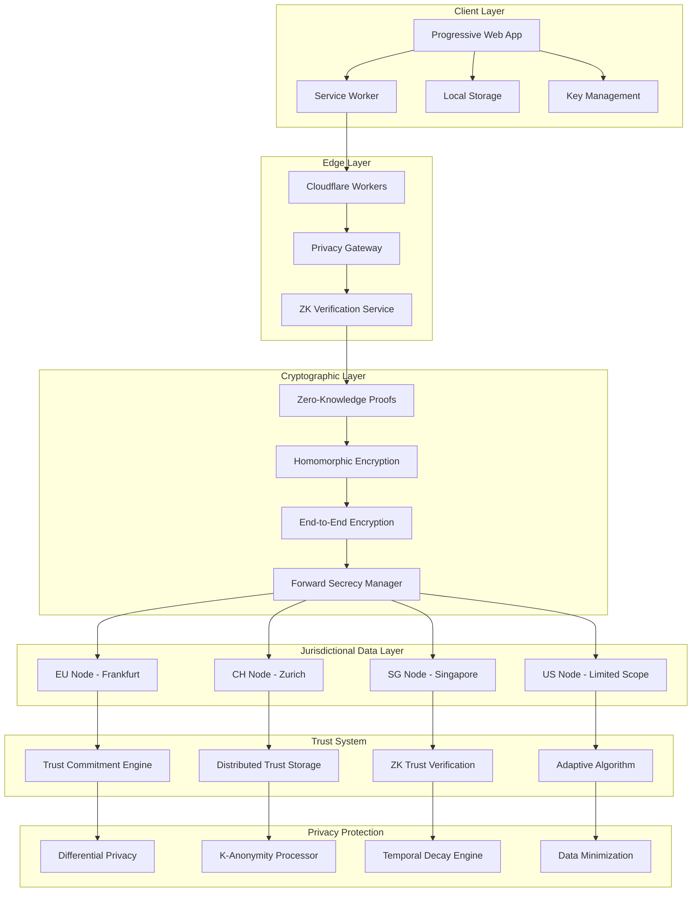

## 2. Zero-Knowledge Trust System

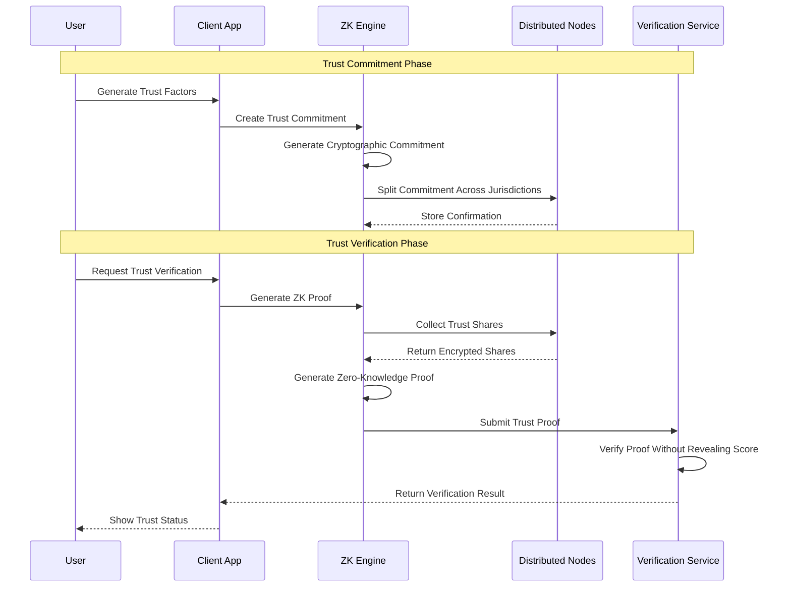

## 3. Multi-Jurisdictional Data Distribution

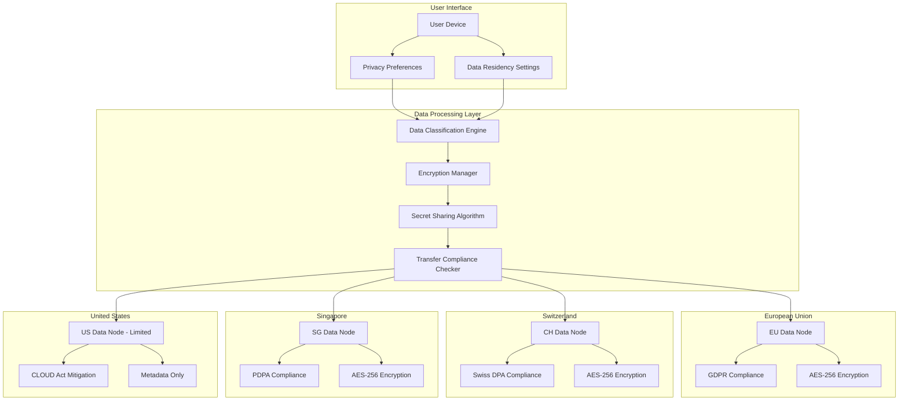

## 4. Cryptographic Protection Layers

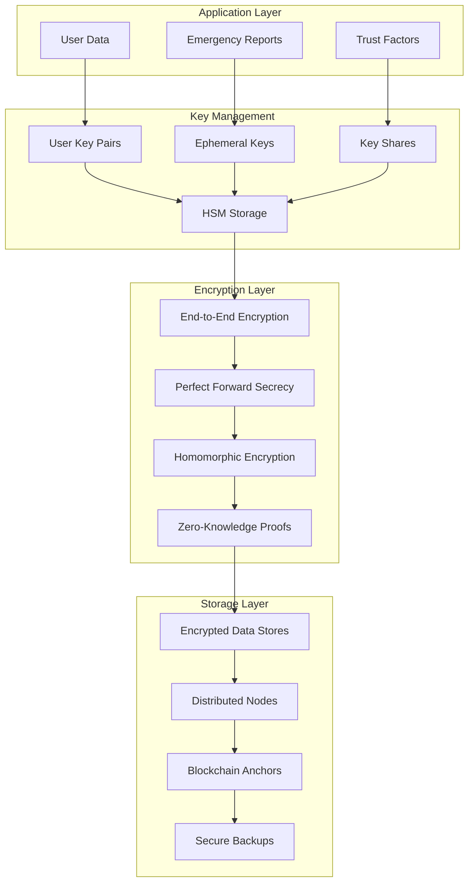

## 5. Privacy-Preserving Emergency Response

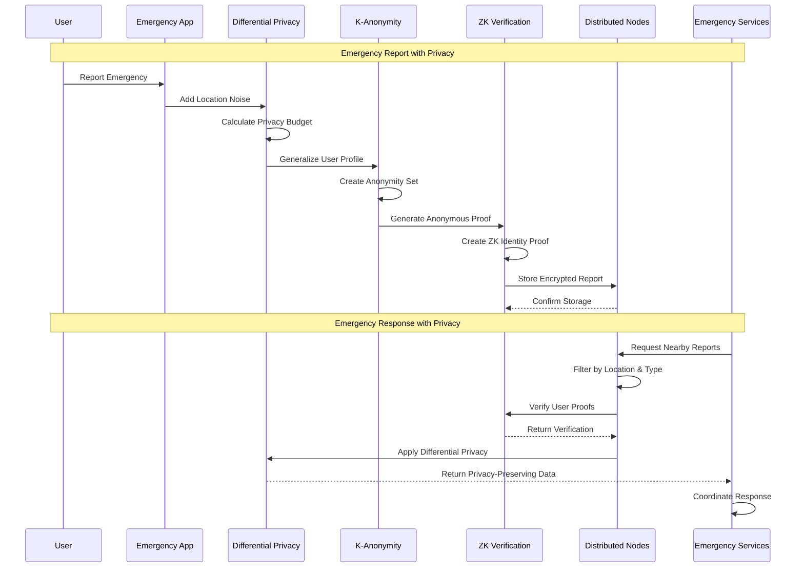

## 6. Access Control & Audit Framework

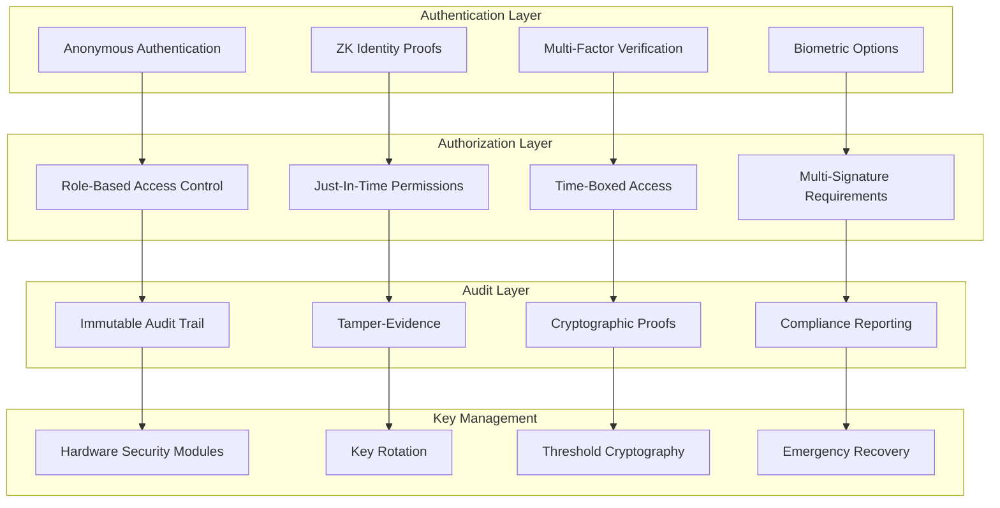

## 7. Legal Resistance Mechanisms

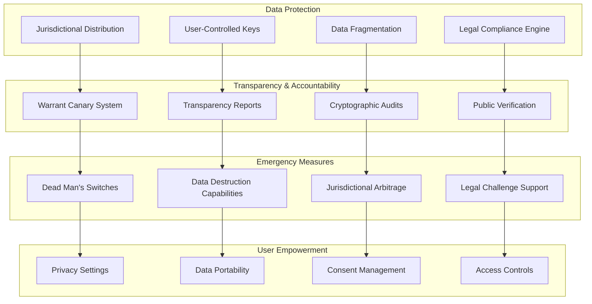

## 8. Data Flow Architecture

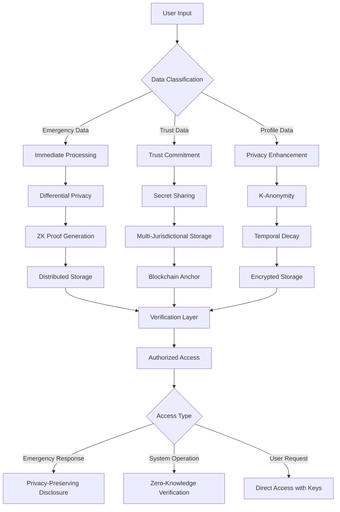

## 9. Threat Mitigation Architecture

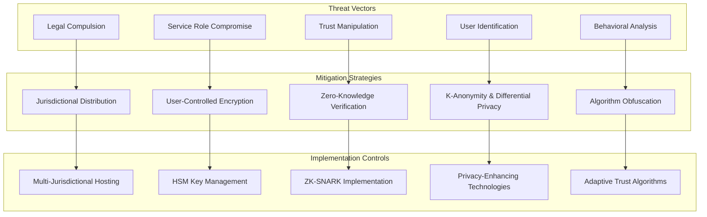

## 10. Migration Path Architecture

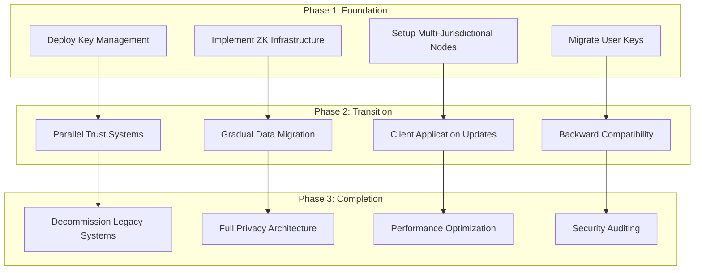

## 11. Performance Optimization Architecture

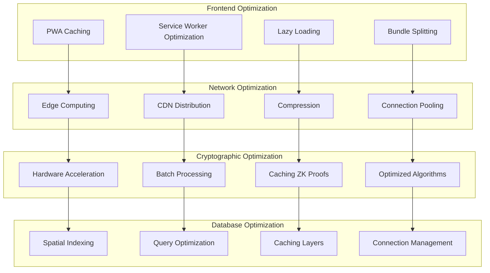

## 12. Compliance Monitoring Architecture

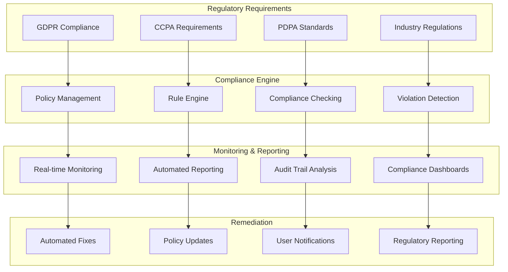

These diagrams provide a comprehensive visual representation of the OpenRelief data protection architecture, showing how different components interact to provide robust privacy protection while maintaining emergency response capabilities. The architecture is designed to be implemented within the 6-month timeline and limited budget constraints while addressing the most critical vulnerabilities identified in the current system.