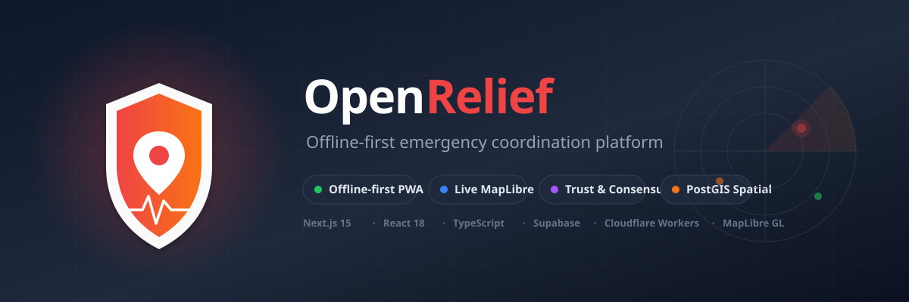
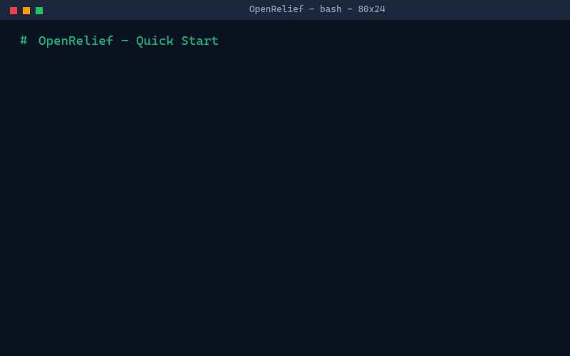
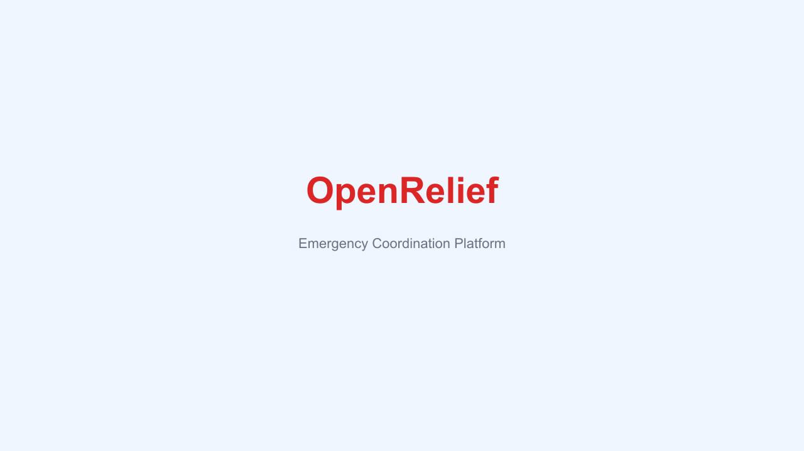
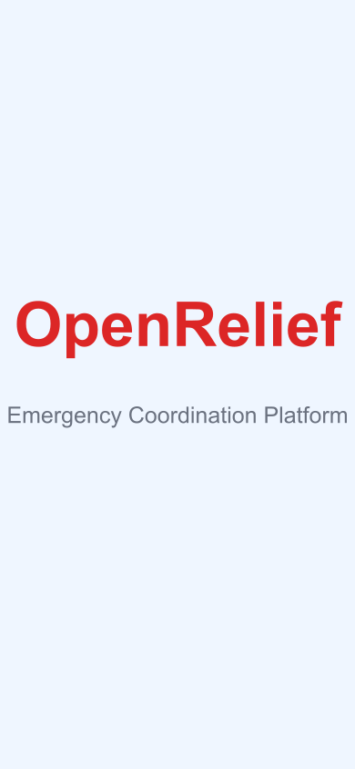
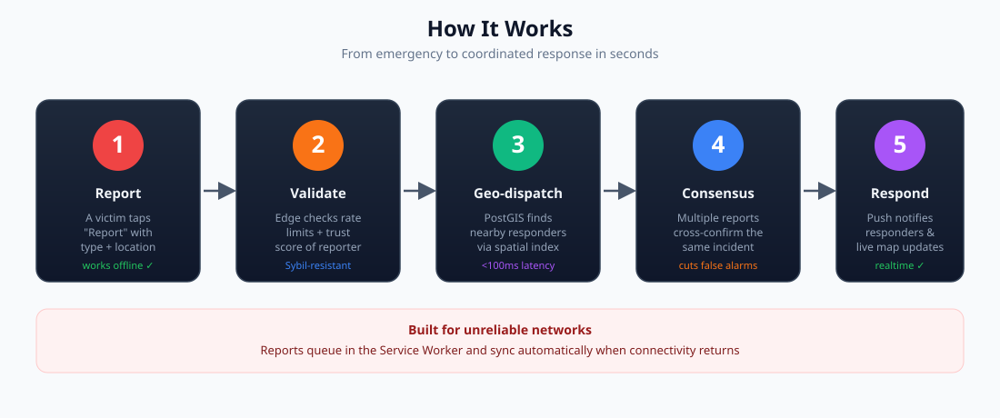
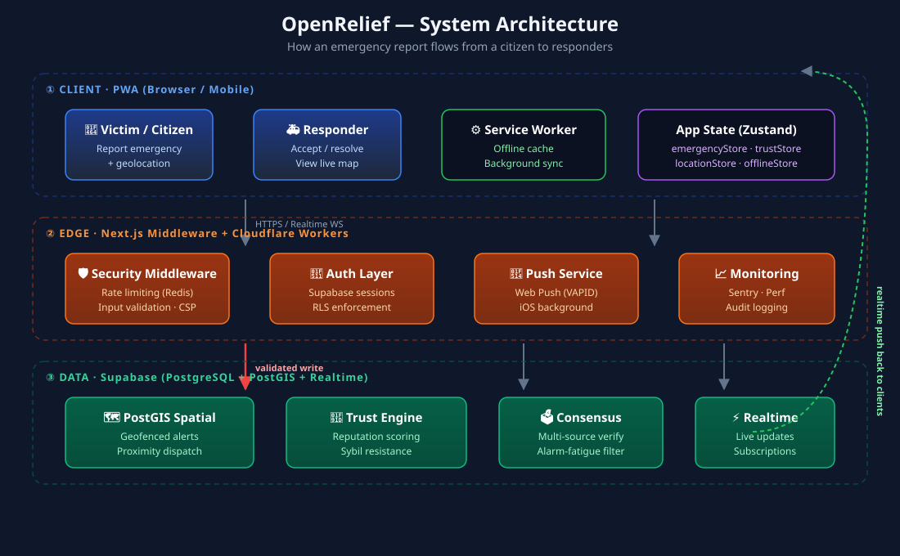

<p align="center">
  
</p>

<p align="center">
  <strong>Open-source, offline-first emergency coordination platform.</strong><br/>
  Connect victims with resources through a privacy-preserving, decentralized PWA.
</p>

<p align="center">
  <a href="LICENSE"></a>
  
  
  
  <a href="CONTRIBUTING.md"></a>
  <a href="SECURITY.md"></a>
</p>

<p align="center">
  <a href="#-quick-start">Quick Start</a> ·
  <a href="#-how-it-works">How It Works</a> ·
  <a href="#-architecture">Architecture</a> ·
  <a href="#-project-structure">Structure</a> ·
  <a href="#-contributing">Contributing</a> ·
  <a href="docs/">Docs</a>
</p>

---

OpenRelief is a **Progressive Web App** for decentralized emergency
coordination. It connects victims with resources via a privacy-preserving
interface, addressing scaling bottlenecks through database-native spatial
filtering and mitigating alarm fatigue through intelligent consensus and
trust algorithms.

> **Why?** During disasters, centralized systems fail and networks drop out.
> OpenRelief is built to keep working when it matters most — offline-first,
> trust-weighted, and geographically aware.

## ✨ Key Features

| Feature | What it does |
| --- | --- |
| 🔴 **Emergency Reporting** | One-tap reporting with type, severity, and automatic geolocation |
| 🗺️ **Live Map** | MapLibre GL map with real-time incident markers and resource overlays |
| 📴 **Offline-First PWA** | Service Worker caches the app; reports queue and sync when back online |
| 🤝 **Trust & Reputation** | Weighted trust scores resist Sybil attacks and false reporting |
| 🗳️ **Consensus Engine** | Cross-confirms incidents from multiple sources to cut alarm fatigue |
| 📍 **Geofenced Dispatch** | PostGIS spatial queries route alerts to nearby responders in <100ms |
| 🔔 **Push Notifications** | Web Push (VAPID) with iOS background-silent delivery |
| 🔒 **Privacy-First** | Row-Level Security, data export, and GDPR-aligned controls |

## 🚀 Quick Start

### Prerequisites

- **Node.js 18+** (Node 20 LTS recommended)
- **npm 8+**
- **Supabase CLI** (for local database): `npm install -g supabase`
- **Docker** (required by `supabase start` for local Postgres + PostGIS)

### Launch in 5 Steps

```bash
# 1. Clone the repository
git clone https://github.com/openrelief/openrelief.git
cd openrelief

# 2. Install dependencies
npm install

# 3. Start local Supabase (PostgreSQL + PostGIS + Auth)
supabase start

# 4. Configure environment variables
cp .env.example .env.local
#    → Fill in the Supabase URL + keys from `supabase status`

# 5. Run the development server
npm run dev
```

Open **[http://localhost:3000](http://localhost:3000)** and you're live. 🎉

<details>
<summary><b>🖥️ Watch the terminal launch in action</b></summary>

<p align="center">
  
</p>

> To regenerate this GIF locally: `bash scripts/make-launch-gif.sh`
> (requires `ffmpeg`).

</details>

<details>
<summary><b>📸 See the app</b></summary>

<table>
  <tr>
    <td width="60%"></td>
    <td width="40%"></td>
  </tr>
  <tr>
    <td align="center"><sub>Desktop — report & map</sub></td>
    <td align="center"><sub>Mobile — offline-ready PWA</sub></td>
  </tr>
</table>

</details>

### Available Scripts

| Command | Description |
| --- | --- |
| `npm run dev` | Start Next.js dev server |
| `npm run build` | Production build |
| `npm run start` | Start production server |
| `npm run lint` | Run ESLint |
| `npm run type-check` | TypeScript type check (`tsc --noEmit`) |
| `npm test` | Run Jest unit/integration tests |
| `npm run test:e2e:playwright` | Run Playwright E2E tests |
| `npm run test:coverage` | Coverage report |
| `npm run db:migrate` | Push Supabase migrations |
| `npm run db:seed` | Seed local database |
| `npm run format` | Format with Prettier |

See [`AGENTS.md`](AGENTS.md) for the full command reference.

## 🧭 How It Works

<p align="center">
  
</p>

1. **Report** — A victim (or bystander) opens the PWA and taps "Report",
   selecting an emergency type. Their geolocation is attached automatically.
   This works **offline**: the report queues in the Service Worker.
2. **Validate** — When connectivity returns, the request hits the edge
   (Next.js middleware / Cloudflare Workers). Rate limiting, input validation,
   and the reporter's trust score gate the submission to resist Sybil attacks.
3. **Geo-dispatch** — Supabase PostGIS runs a spatial proximity query to find
   responders and resources near the incident — typically **under 100ms**.
4. **Consensus** — The consensus engine cross-checks whether other reports
   describe the same incident, raising confidence and suppressing duplicate
   alarms (mitigating **alarm fatigue**).
5. **Respond** — Verified alerts push to nearby responders via Web Push and
   appear instantly on the live map through Supabase Realtime.

## 🏗️ Architecture

<p align="center">
  
</p>

OpenRelief is a **three-tier** system:

- **① Client (PWA)** — Next.js 15 App Router + React 18 + Zustand. A Service
  Worker provides offline caching and background sync. TanStack Query handles
  server state; Zustand manages local/realtime state (`emergencyStore`,
  `trustStore`, `locationStore`, `offlineStore`).
- **② Edge** — Next.js middleware plus optional Cloudflare Workers enforce
  security headers, Redis-backed rate limiting, input validation, Supabase
  auth sessions, Web Push delivery, and Sentry monitoring.
- **③ Data (Supabase)** — PostgreSQL 15 with **PostGIS** powers spatial
  queries and geofencing. Row-Level Security (RLS) governs data access. The
  **Trust Engine** scores reporter reputation; the **Consensus Engine**
  corroborates incidents. Supabase **Realtime** streams live map updates.

### Tech Stack

| Layer | Technology |
| --- | --- |
| Framework | Next.js 15 (App Router), React 18 |
| Language | TypeScript (strict mode) |
| Database / Auth | Supabase (PostgreSQL, PostGIS, Auth, RLS, Realtime) |
| State | Zustand (persist + subscribeWithSelector) |
| Data Fetching | TanStack Query v5 |
| Styling | Tailwind CSS + CVA + Radix UI |
| Maps | MapLibre GL JS |
| Spatial | Turf.js + geolib |
| Edge Functions | Cloudflare Workers |
| Monitoring | Sentry (client/server/edge) |
| Rate Limiting | Upstash Redis |
| Validation | Zod + custom validators |

## 📁 Project Structure

```
openrelief/
├── src/
│   ├── app/                 # Next.js App Router (pages + API routes)
│   ├── components/          # UI, map, trust, emergency, providers...
│   ├── hooks/               # Custom React hooks (queries, mutations)
│   ├── store/               # Zustand state stores
│   ├── lib/                 # Supabase client, security, monitoring, utils
│   ├── edge/                # Cloudflare Workers
│   ├── types/               # TypeScript definitions
│   └── middleware.ts        # Security, rate limiting, validation
├── supabase/                # Migrations, config, seed data
├── public/                  # Static assets, PWA icons, service worker
├── docs/                    # Comprehensive documentation
├── tests/                   # Test suites
├── scripts/                 # Build/test/utility scripts
└── .github/                 # CI workflows, PR template, code owners
```

## 🧪 Testing

```bash
npm test                      # All Jest unit/integration tests
npm run test:coverage         # Coverage report
npm run test:e2e:playwright   # E2E tests (Playwright)
npm run test:lighthouse       # Lighthouse CI performance audit
```

The project targets **>80% coverage** on critical components and **<100ms**
alert dispatch latency. See [`docs/testing/`](docs/testing/) for details.

## 🔐 Environment Variables

Copy `.env.example` to `.env.local` and fill in your keys. **Required** for
the app to boot:

| Variable | Required | Purpose |
| --- | --- | --- |
| `NEXT_PUBLIC_SUPABASE_URL` | ✅ | Supabase project URL |
| `NEXT_PUBLIC_SUPABASE_ANON_KEY` | ✅ | Supabase anonymous (public) key |
| `SUPABASE_SERVICE_ROLE_KEY` | ✅ | Server-side service role key |

Optional variables (Redis, Sentry, VAPID push, MapTiler, etc.) are documented
in [`.env.example`](.env.example). Run `supabase status` to find your local
keys during development.

## 🤝 Contributing

Contributions are welcome! This is an open-source project built by the
community.

1. **Fork** the repository and create a branch from `main`
2. **Install** deps: `npm install`
3. **Develop** — run `npm run dev`, `npm run lint`, `npm run type-check`
4. **Test** — add/Update tests; ensure `npm test` passes
5. **Commit** — pre-commit hooks (Husky + lint-staged) auto-format your code
6. **Open a PR** — describe your changes using the [PR template](.github/pull_request_template.md)

Read the full [**Contributing Guide**](CONTRIBUTING.md) and
[**Code of Conduct**](CODE_OF_CONDUCT.md).

<details>
<summary><b>🎯 Priority contribution areas</b></summary>

- **Frontend/PWA** — Service Worker optimization, MapLibre performance, offline sync
- **Database** — PostGIS spatial query tuning, RLS policies, triggers
- **Security/Privacy** — Trust algorithm, Sybil prevention, GDPR tooling
- **DevOps** — CI/CD, edge function deployment, monitoring
- **Mobile** — iOS background processing, push delivery

</details>

## 📚 Documentation

The full documentation index lives at **[docs/index.md](docs/index.md)**.
Quick links:

- [Architecture](docs/architecture/overview.md) — as-built overview, diagrams, data model, trust & consensus
- [API reference](docs/api/) — endpoints, auth, realtime
- [Database schema](docs/database/schema.md) — full DDL, RLS, functions
- [Deployment](docs/deployment/overview.md) — Vercel + Supabase + Cloudflare
- [Security](SECURITY.md) · [Privacy](docs/privacy/Privacy_Implementation_Guide.md)
- [Getting started](docs/getting-started/) · [Contributing](CONTRIBUTING.md)

## 🆘 Getting Help

- **Issues**: [Report bugs or request features](https://github.com/openrelief/openrelief/issues)
- **Discussions**: [Ask questions](https://github.com/openrelief/openrelief/discussions)
- **Good first issues**: [Start here](https://github.com/openrelief/openrelief/labels/good%20first%20issue)

## 📈 Roadmap

- [x] **Foundation** — Repository, Next.js PWA, MapLibre, DB schema
- [x] **Trust System** — Trust scores, consensus engine, Sybil resistance
- [x] **Alert Optimization** — PostGIS tuning, edge functions, iOS background
- [ ] **Resilience** — Offline mesh networking, LoRaWAN integration

## 📄 License

OpenRelief is licensed under the [**MIT License**](LICENSE).

---

<p align="center">
  <sub>Built with ❤️ for resilient communities. Every contribution helps save lives during emergencies.</sub><br/>
  <a href="#top">↑ Back to top</a>
</p>
