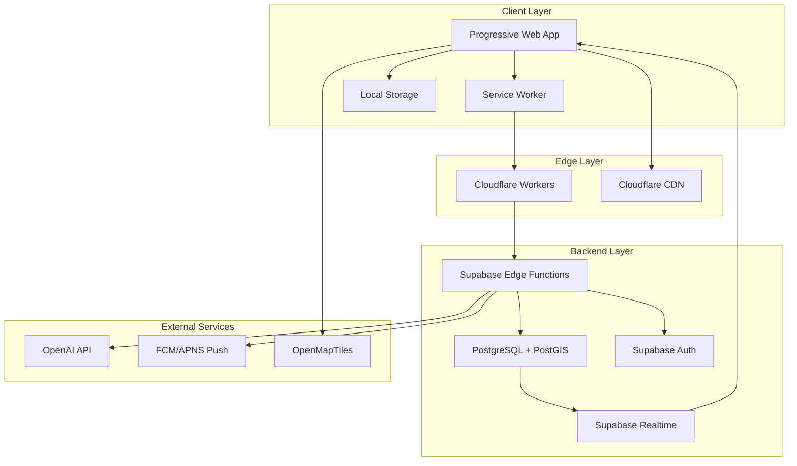
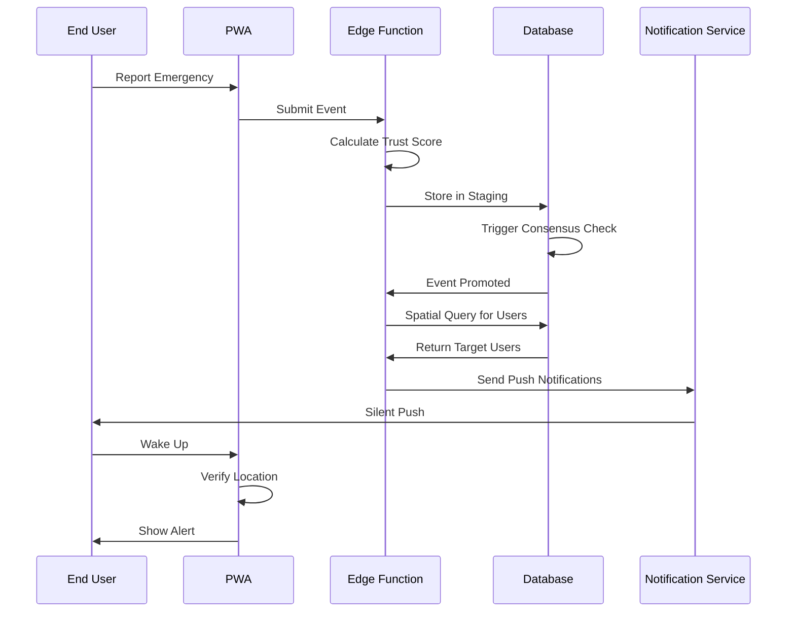

# ADR-001: Technical Architecture

## Status

**Accepted**

## Context

OpenRelief v2.0 is an open-source, offline-first Progressive Web App for decentralized emergency coordination. The system must handle:

- Real-time emergency event reporting and validation
- Trust-weighted consensus for event verification
- High-performance spatial alert dispatch
- Offline functionality with sync capabilities
- Privacy-preserving user experience
- Scalability to 50K+ concurrent users

## Decision

We have chosen a **Serverless, Edge-First Architecture** with the following components:

### Frontend Architecture
- **Framework**: Next.js 15+ with App Router
- **State Management**: TanStack Query (server) + Zustand (client)
- **Maps**: MapLibre GL JS with OpenMapTiles
- **PWA**: Service Workers with Background Sync
- **Styling**: CSS Modules with Tailwind CSS

### Backend Architecture
- **Database**: Supabase (PostgreSQL 15+ with PostGIS)
- **Edge Functions**: Cloudflare Workers
- **Authentication**: Supabase Auth with RLS
- **Real-time**: Supabase Realtime subscriptions
- **File Storage**: Supabase Storage

### Infrastructure
- **Hosting**: Vercel (frontend) + Supabase (backend)
- **CDN**: Cloudflare for static assets
- **Monitoring**: Sentry (errors) + Supabase (metrics)
- **CI/CD**: GitHub Actions

## Detailed Architecture

### System Components



### Data Flow Architecture



## Database Schema Architecture

### Core Tables

```sql
-- User Profiles with Trust System
CREATE TABLE user_profiles (
    user_id UUID PRIMARY KEY REFERENCES auth.users,
    trust_score FLOAT DEFAULT 0.1 CHECK (trust_score >= 0.0 AND trust_score <= 1.0),
    last_known_location GEOGRAPHY(POINT, 4326),
    active_session_start TIMESTAMPTZ,
    created_at TIMESTAMPTZ DEFAULT NOW(),
    updated_at TIMESTAMPTZ DEFAULT NOW()
);

-- Spatial Index for Performance
CREATE INDEX idx_user_profiles_location 
ON user_profiles USING GIST (last_known_location);

-- Emergency Events
CREATE TABLE emergency_events (
    id UUID PRIMARY KEY DEFAULT gen_random_uuid(),
    type_slug TEXT REFERENCES emergency_types(slug),
    severity INTEGER CHECK (severity BETWEEN 1 AND 5),
    location GEOGRAPHY(POINT, 4326),
    radius_meters INTEGER,
    status TEXT DEFAULT 'pending' CHECK (status IN ('pending', 'active', 'resolved')),
    trust_weight FLOAT DEFAULT 0.0,
    created_at TIMESTAMPTZ DEFAULT NOW(),
    expires_at TIMESTAMPTZ
);

-- Spatial Index for Events
CREATE INDEX idx_emergency_events_location 
ON emergency_events USING GIST (location);

-- User Subscriptions (Normalized)
CREATE TABLE user_subscriptions (
    user_id UUID REFERENCES user_profiles(user_id),
    topic_id INTEGER REFERENCES emergency_types(id),
    created_at TIMESTAMPTZ DEFAULT NOW(),
    PRIMARY KEY (user_id, topic_id)
);
```

### Trust Algorithm Architecture

```sql
-- Trust Score Calculation
CREATE OR REPLACE FUNCTION calculate_trust_score(
    user_id_param UUID,
    event_type TEXT
) RETURNS FLOAT AS $$
DECLARE
    base_score FLOAT := 0.1;
    accuracy_bonus FLOAT := 0.0;
    recency_multiplier FLOAT := 1.0;
    total_score FLOAT;
BEGIN
    -- Calculate accuracy bonus from historical reports
    SELECT COALESCE(AVG(CASE 
        WHEN status = 'confirmed' THEN 0.1
        WHEN status = 'false_positive' THEN -0.2
        ELSE 0.0
    END), 0.0) INTO accuracy_bonus
    FROM emergency_events 
    WHERE reporter_id = user_id_param 
    AND created_at > NOW() - INTERVAL '30 days';
    
    -- Calculate recency multiplier
    SELECT COALESCE(
        1.0 - (EXTRACT(EPOCH FROM (NOW() - MAX(created_at))) / (30 * 24 * 3600)) * 0.5,
        0.5
    ) INTO recency_multiplier
    FROM emergency_events 
    WHERE reporter_id = user_id_param;
    
    -- Calculate final score
    total_score := GREATEST(0.0, LEAST(1.0, 
        base_score + accuracy_bonus * recency_multiplier
    ));
    
    RETURN total_score;
END;
$$ LANGUAGE plpgsql;
```

## Frontend Architecture

### Component Structure

```
src/
├── app/                    # Next.js App Router
│   ├── (auth)/            # Authentication routes
│   ├── dashboard/         # Main dashboard
│   ├── map/              # Map interface
│   └── profile/          # User profile
├── components/            # Reusable components
│   ├── ui/               # Basic UI components
│   ├── forms/            # Form components
│   ├── map/              # Map-specific components
│   └── emergency/        # Emergency-related components
├── hooks/                # Custom React hooks
│   ├── useAuth.ts        # Authentication hook
│   ├── useLocation.ts     # Geolocation hook
│   ├── useEmergency.ts    # Emergency data hook
│   └── useTrust.ts       # Trust score hook
├── lib/                  # Utility functions
│   ├── supabase.ts       # Supabase client
│   ├── maps.ts           # Map utilities
│   ├── notifications.ts   # Notification helpers
│   └── trust.ts          # Trust calculations
├── store/                # Zustand stores
│   ├── authStore.ts       # Authentication state
│   ├── locationStore.ts   # Location state
│   └── emergencyStore.ts  # Emergency state
└── types/                # TypeScript definitions
    ├── auth.ts            # Auth types
    ├── emergency.ts       # Emergency types
    └── location.ts        # Location types
```

### State Management Architecture

```typescript
// Server State with TanStack Query
const useEmergencyEvents = () => {
  return useQuery({
    queryKey: ['emergency-events'],
    queryFn: async () => {
      const { data, error } = await supabase
        .from('emergency_events')
        .select('*')
        .eq('status', 'active');
      
      if (error) throw error;
      return data;
    },
    staleTime: 30 * 1000, // 30 seconds
    refetchInterval: 60 * 1000, // 1 minute
  });
};

// Client State with Zustand
interface EmergencyStore {
  selectedEvent: EmergencyEvent | null;
  userLocation: GeolocationPosition | null;
  isOffline: boolean;
  setSelectedEvent: (event: EmergencyEvent | null) => void;
  setUserLocation: (location: GeolocationPosition) => void;
  setOfflineStatus: (status: boolean) => void;
}

const useEmergencyStore = create<EmergencyStore>((set) => ({
  selectedEvent: null,
  userLocation: null,
  isOffline: navigator.onLine,
  setSelectedEvent: (event) => set({ selectedEvent: event }),
  setUserLocation: (location) => set({ userLocation: location }),
  setOfflineStatus: (status) => set({ isOffline: status }),
}));
```

## Performance Optimization

### Database Optimization

1. **Spatial Indexing**: GIST indexes on all location columns
2. **Query Optimization**: PostGIS functions for spatial filtering
3. **Connection Pooling**: PgBouncer for connection management
4. **Caching**: Redis for frequently accessed data

### Frontend Optimization

1. **Code Splitting**: Route-based and component-based splitting
2. **Image Optimization**: Next.js Image component with WebP
3. **Bundle Analysis**: Regular webpack-bundle-analyzer reviews
4. **Caching**: Service worker for offline functionality

### Edge Optimization

1. **Global Distribution**: Cloudflare Workers in 200+ locations
2. **Response Compression**: Brotli compression for all responses
3. **Cache Headers**: Aggressive caching for static assets
4. **Edge Functions**: Compute closer to users

## Security Architecture

### Authentication & Authorization

```typescript
// Row Level Security Policies
CREATE POLICY "Users can view their own profile" ON user_profiles
    FOR SELECT USING (auth.uid() = user_id);

CREATE POLICY "Users can update their own profile" ON user_profiles
    FOR UPDATE USING (auth.uid() = user_id);

CREATE POLICY "Users can insert emergency events" ON emergency_events
    FOR INSERT WITH CHECK (auth.uid() = reporter_id);

CREATE POLICY "Users can view active emergency events" ON emergency_events
    FOR SELECT USING (
        status = 'active' AND 
        ST_DWithin(
            last_known_location,
            (SELECT last_known_location FROM user_profiles WHERE user_id = auth.uid()),
            10000 -- 10km radius
        )
    );
```

### Data Privacy

1. **Location Anonymization**: Precision reduction after 7 days
2. **Data Retention**: Automatic deletion after 30 days
3. **Encryption**: End-to-end encryption for sensitive data
4. **Audit Logging**: Complete audit trail for all data access

## Scalability Architecture

### Horizontal Scaling

1. **Database**: Read replicas for read-heavy operations
2. **Edge Functions**: Auto-scaling based on demand
3. **CDN**: Global distribution of static assets
4. **Load Balancing**: Automatic failover between regions

### Performance Targets

- **Alert Dispatch**: < 100ms for 50K+ concurrent users
- **Database Queries**: < 10ms for spatial queries
- **Page Load**: < 3 seconds on 3G networks
- **Offline Cache**: 24+ hours of functionality

## Monitoring & Observability

### Application Monitoring

```typescript
// Error Tracking with Sentry
import * as Sentry from '@sentry/nextjs';

Sentry.init({
  dsn: process.env.SENTRY_DSN,
  environment: process.env.NODE_ENV,
  tracesSampleRate: 1.0,
});

// Performance Monitoring
const reportWebVitals = (metric) => {
  // Send to analytics service
  gtag('event', metric.name, {
    value: Math.round(metric.name === 'CLS' ? metric.value * 1000 : metric.value),
    event_category: 'Web Vitals',
  });
};
```

### Database Monitoring

1. **Query Performance**: pg_stat_statements for slow queries
2. **Connection Monitoring**: PgBouncer metrics
3. **Resource Usage**: CPU, memory, and disk monitoring
4. **Backup Monitoring**: Automated backup verification

## Deployment Architecture

### CI/CD Pipeline

```yaml
# GitHub Actions Workflow
name: Deploy to Production

on:
  push:
    branches: [main]

jobs:
  test:
    runs-on: ubuntu-latest
    steps:
      - uses: actions/checkout@v3
      - uses: actions/setup-node@v3
      - run: npm ci
      - run: npm run test
      - run: npm run lint
      - run: npm run type-check

  deploy:
    needs: test
    runs-on: ubuntu-latest
    steps:
      - uses: actions/checkout@v3
      - name: Deploy to Vercel
        uses: amondnet/vercel-action@v20
        with:
          vercel-token: ${{ secrets.VERCEL_TOKEN }}
          vercel-org-id: ${{ secrets.ORG_ID }}
          vercel-project-id: ${{ secrets.PROJECT_ID }}
```

### Environment Configuration

```typescript
// Environment Variables
const config = {
  database: {
    url: process.env.DATABASE_URL,
    maxConnections: parseInt(process.env.DB_MAX_CONNECTIONS || '20'),
  },
  auth: {
    jwtSecret: process.env.JWT_SECRET,
    sessionTimeout: parseInt(process.env.SESSION_TIMEOUT || '3600'),
  },
  maps: {
    tileUrl: process.env.MAP_TILE_URL,
    apiKey: process.env.MAP_API_KEY,
  },
  notifications: {
    fcmKey: process.env.FCM_KEY,
    apnsKey: process.env.APNS_KEY,
  },
};
```

## Rationale

### Why This Architecture?

1. **Performance**: Edge-first approach ensures low latency globally
2. **Scalability**: Serverless architecture handles variable load efficiently
3. **Reliability**: Multiple layers of redundancy and failover
4. **Security**: Defense-in-depth with multiple security layers
5. **Maintainability**: Clear separation of concerns and modular design
6. **Cost-Effectiveness**: Pay-per-use model minimizes fixed costs

### Alternative Considered

1. **Monolithic Architecture**: Rejected due to scaling limitations
2. **Microservices**: Rejected due to complexity for current team size
3. **Traditional Hosting**: Rejected due to higher operational overhead
4. **Proprietary Maps**: Rejected Mapbox due to cost, chose MapLibre

## Consequences

### Positive Consequences

- **Global Performance**: Sub-100ms response times worldwide
- **Developer Experience**: Modern tools and frameworks
- **Cost Efficiency**: Pay-per-use pricing model
- **Reliability**: Built-in redundancy and failover
- **Security**: Multiple layers of security protection

### Negative Consequences

- **Complexity**: More complex than simple monolithic application
- **Learning Curve**: Team needs to learn new technologies
- **Vendor Lock-in**: Some dependency on specific providers
- **Debugging**: More complex debugging across distributed system

## Future Considerations

1. **Multi-Region Deployment**: Deploy to multiple cloud providers
2. **Advanced Caching**: Implement edge-side caching strategies
3. **Machine Learning**: Add ML for trust score optimization
4. **Hardware Integration**: LoRaWAN and IoT device support
5. **Blockchain**: Consider blockchain for trust system verification

---

*This ADR will be updated as the architecture evolves and new requirements emerge.*