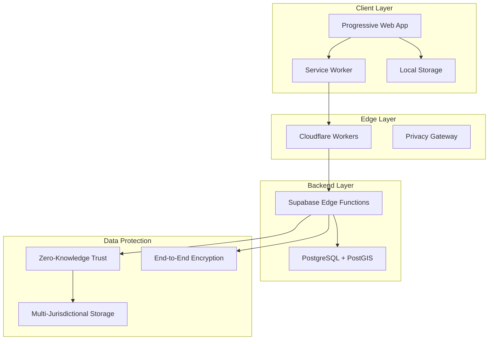

# Architecture Documentation

## Overview

OpenRelief v2.0 is an open-source, offline-first Progressive Web App (PWA) for decentralized emergency coordination. The platform connects victims with resources via a privacy-preserving interface.

### Architecture Diagram

## Documentation Index

| Document | Description | Audience |
|----------|-------------|----------|
| [Technical Design & Specifications](./technical-design.md) | Core technologies, database schema, feature modules, and roadmap | Developers, Architects |
| [System Architecture](./system-architecture.md) | System diagrams, component relationships, data flow, and deployment architecture | Developers, DevOps |
| [Data Protection](./data-protection.md) | Zero-knowledge trust system, cryptographic protections, and privacy controls | Security Engineers, Privacy Officers |

## Key Architectural Decisions

### Serverless, Edge-First Architecture

**Rationale**: Sub-100ms response times worldwide with automatic scaling

**Benefits**:
- Global performance via edge distribution
- Cost-effective pay-per-use model
- Built-in redundancy and failover

### Trust-Weighted Consensus

**Algorithm**: Events promote from pending to active when weighted vote sum exceeds threshold (5.0)

**Formula**:
$$V_{total} = \sum_{i=1}^{n} (T_{user} \times w_{decay})$$

**Purpose**: Prevent Sybil attacks and spam through reputation-based verification

### Intelligent Fatigue Guard

**Logic**: Inverse-square relevance calculation prevents alarm fatigue

**Formula**:
$$R = \frac{S_{event}}{1 + (\frac{d}{500})^2}$$

**Purpose**: Physics-based relevance ensures natural attenuation and prevents singularities

### Database-Native Filtering

**Technology**: PostGIS spatial queries

**Complexity**: O(log N) vs O(N) application iteration

**Purpose**: Scalable alert dispatch for 50K+ concurrent users

## Technology Stack

### Frontend

| Component | Technology |
|-----------|-------------|
| Framework | Next.js 15+ (App Router) |
| State Management | TanStack Query + Zustand |
| Maps | MapLibre GL JS + OpenMapTiles |
| PWA | Service Workers + Background Sync |

### Backend

| Component | Technology |
|-----------|-------------|
| Database | Supabase (PostgreSQL 15+ with PostGIS) |
| Auth | Supabase Auth with RLS |
| Real-time | Supabase Realtime |
| Edge Functions | Cloudflare Workers |

### Security

| Component | Technology |
|-----------|-------------|
| Zero-Knowledge Proofs | zk-SNARKs |
| Encryption | AES-256-GCM, X25519 |
| Homomorphic Encryption | BFV Scheme |
| Secret Sharing | Shamir's (3-of-5) |

## Privacy & Security Principles

### Privacy by Design
- **Zero-Knowledge Proofs**: Verify trust without revealing scores
- **Differential Privacy**: Add Laplace noise to queries
- **K-Anonymity**: Generalize user data to anonymity sets
- **Temporal Decay**: Automatic data degradation over time

### Cryptographic Protections
- **End-to-End Encryption**: User-controlled encryption keys
- **Perfect Forward Secrecy**: Ephemeral keys with 1-hour TTL
- **Distributed Storage**: Multi-jurisdictional data distribution
- **HSM Integration**: Hardware-backed key management

### Compliance
- **GDPR**: Full compliance with EU data protection standards
- **PDPA**: Singapore data protection compliance
- **CLOUD Act Mitigation**: Jurisdictional arbitrage strategy

## Performance Targets

| Metric | Target |
|--------|--------|
| Alert Dispatch | < 100ms for 50K+ users |
| Database Queries | < 10ms for spatial queries |
| Page Load | < 3 seconds on 3G networks |
| Offline Cache | 24+ hours of functionality |
| Trust Verification | < 10ms for ZK proof |

## Related Documentation

- [Technical Design](./technical-design.md) - Database schema, feature modules, and implementation details
- [System Architecture](./system-architecture.md) - Detailed system diagrams and data flow
- [Data Protection](./data-protection.md) - Zero-knowledge trust system and cryptographic protections
- [ADR-001](./ADR-001-technical-architecture.md) - Architecture decision record

---

*For implementation details, see [Developer Guide](../development/DEVELOPER_CONTRIBUTION_GUIDE.md).*
