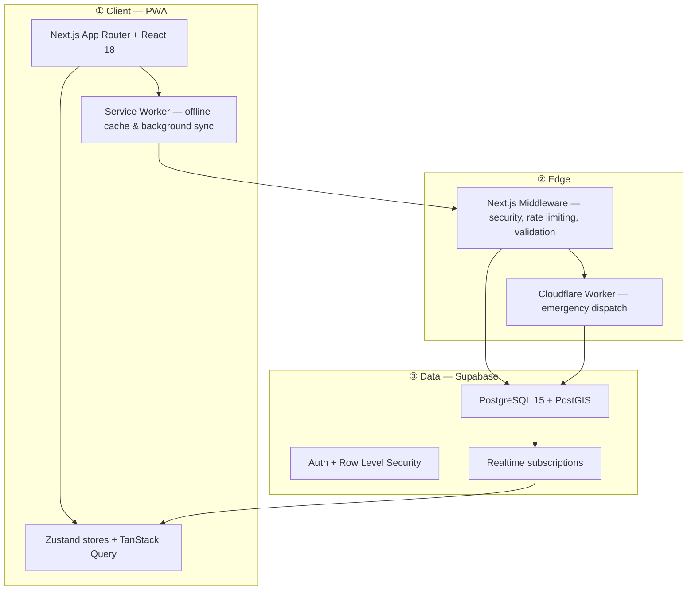

# Architecture Overview

> **What this is:** a description of the OpenRelief architecture **as actually
> built today**. For proposed-but-unimplemented directions (zero-knowledge
> proofs, homomorphic encryption, multi-jurisdictional storage), see
> [Future Vision](future-vision.md).

OpenRelief is an open-source, **offline-first Progressive Web App (PWA)** for
decentralized emergency coordination. It connects people needing help with
people who can help, using a privacy-preserving, trust-weighted, and
geographically aware design that keeps working when networks drop out.

## Three-Tier Architecture



### ① Client (PWA)

A **Next.js 15 App Router** + **React 18** application. Offline behavior comes
from a Service Worker that caches the app shell and queues actions for
background sync. Client state is split:

- **Zustand stores** (`src/store/`) hold local/realtime UI state — auth,
  emergency events, trust, location, notifications, offline queue. See
  [State Management](../state-management.md).
- **TanStack Query v5** (`src/hooks/queries/`) manages server state with
  caching, optimistic updates, and automatic invalidation.

### ② Edge

Two edge layers:

- **Next.js Middleware** (`src/middleware.ts`) enforces security headers (CSP,
  HSTS, COOP/COEP), **Redis-backed rate limiting** with progressive penalties,
  **Sybil-attack detection**, input validation/sanitization, and suspicious-IP
  blocking. It has an in-memory rate-limit fallback when Redis is unavailable.
- **Cloudflare Worker** (`src/edge/emergency-dispatch.ts`) handles emergency
  alert dispatch, targeting **sub-100ms** latency via KV/D1 bindings.

### ③ Data (Supabase)

**PostgreSQL 15 with PostGIS 3.3+** is the data backbone:

- **Spatial queries** power geofenced alert dispatch (find responders within a
  radius, typically in **O(log N)** via GIST indexes — see
  [Data Model](data-model.md)).
- **Row Level Security (RLS)** governs every table — users can only see/modify
  rows they own or are authorized for.
- **Realtime** streams emergency event changes to subscribed clients (map
  updates, confirmations). Channel sharding lives in `src/lib/realtime/`.
- **Auth** is Supabase Auth; sessions are validated server-side via
  `src/lib/supabase/server.ts` (SSR client bound to the request).

The **Trust Engine** scores reporter reputation; the **Consensus Engine**
corroborates incidents to cut alarm fatigue. Both are implemented as database
functions and application logic — see
[Trust & Consensus](trust-and-consensus.md).

## Technology Stack

These are the technologies **in `package.json` and confirmed in use**:

| Layer | Technology | Notes |
| --- | --- | --- |
| Framework | **Next.js 15.5.20** (App Router) | React 18.2 |
| Language | **TypeScript 5.7** (strict mode) | `noUncheckedIndexedAccess`, `exactOptionalPropertyTypes` |
| Database / Auth | **Supabase** (PostgreSQL 15, PostGIS 3.3+, Auth, RLS, Realtime) | Migrations in `supabase/migrations/` |
| Client state | **Zustand 4.4** (`persist` + `subscribeWithSelector`) | `src/store/` |
| Server state | **TanStack Query v5** | `src/hooks/queries/` |
| Styling | **Tailwind CSS 3.3** + CVA + Radix UI | |
| Maps | **MapLibre GL JS 3.6** | Primary map library. `@types/leaflet` is a peer type only. |
| Spatial | **Turf.js 7.3** + **geolib 3.3** | Bbox, buffer, distance, helpers |
| Edge Functions | **Cloudflare Workers** | `src/edge/` |
| Auth (additional) | **next-auth 5 (beta)** + `@auth/core` | `src/lib/auth.ts` |
| Monitoring | **Sentry** (`@sentry/nextjs`) | Client/server/edge instrumentation |
| Rate Limiting | **Upstash Redis** (`@upstash/ratelimit` + `redis`) | `src/lib/redis/` |
| Validation | **Zod 3.22** + custom validators | `src/lib/validation.ts` |
| PWA | **next-pwa** + Workbox | Service worker + background sync |

## Key Architectural Decisions

### Database-native spatial filtering

Alert dispatch uses **PostGIS** `ST_DWithin` and `ST_Distance` with GIST
indexes rather than application-level iteration. This scales to **50K+
concurrent users** with dispatch queries typically under **100ms**. Complexity
is **O(log N)**, not O(N). See the `get_users_for_alert_dispatch` function in
[`../database/schema.md`](../database/schema.md).

### Trust-weighted consensus

Reports don't become visible until corroborated. The `calculate_event_consensus`
function sums trust-weighted confirmations; an event promotes from `pending` to
`active` when the total **exceeds a threshold of 5.0**. This resists Sybil
attacks and false reporting. Details in
[Trust & Consensus](trust-and-consensus.md).

### Intelligent fatigue guard

Alert relevance uses an **inverse-square** formula so alerts attenuate
naturally with distance and never hit a singularity:

$$R = \frac{S_{event}}{1 + (d / 500)^2}$$

where `S` is severity (1–5), `d` is distance in meters, and 500m is the
half-value distance. This prevents alarm fatigue.

### Offline-first

The app is designed to function **24+ hours offline**. The Service Worker
caches the app shell and critical data; user actions (reports, confirmations)
queue in the offline store (`src/store/offlineStore.ts`) and sync when
connectivity returns. Conflict resolution and retry logic live in
`src/lib/offline/`.

### Defense-in-depth security

Layered security: Redis-backed rate limiting with trust-based adjustments,
Sybil detection (`src/lib/security/sybil-*`), input validation
(`src/lib/security/input-validation.ts`), API security middleware
(`src/lib/security/api-security.ts`), incident response
(`src/lib/security/incident-response.ts`), and comprehensive RLS policies. See
[Security Architecture](security-architecture.md).

## Project Structure

```
src/
├── app/                 # Next.js App Router (pages + API routes under api/)
├── components/          # UI, map, trust, emergency, providers, pwa, ...
├── hooks/               # Custom hooks (queries/ for TanStack Query)
├── store/               # Zustand stores
├── lib/                 # supabase, security/, privacy/, redis/, alerts/, ...
├── edge/                # Cloudflare Worker (emergency-dispatch.ts)
├── types/               # TypeScript definitions (database.ts from Supabase)
├── styles/              # mobile.css
└── middleware.ts        # Security, rate limiting, validation
```

> **Note:** `src/state-management/` and `src/mobile/` previously existed as
> doc-only directories. Their READMEs have been moved to
> [`../state-management.md`](../state-management.md) and
> [`../mobile.md`](../mobile.md); the actual code lives in `src/store/`,
> `src/hooks/`, and `src/components/mobile/`.

## Performance Targets

| Metric | Target |
| --- | --- |
| Alert dispatch latency | < 100ms for 50K+ users |
| Spatial query latency | < 10ms (indexed) |
| Page load | < 3s on 3G |
| Offline functionality | 24+ hours |

## Where to Go Next

| Topic | Document |
| --- | --- |
| System diagrams (stack, data flow, deployment) | [System Diagrams](system-diagrams.md) |
| Database tables, RLS, functions | [Data Model](data-model.md) (full DDL in [`../database/schema.md`](../database/schema.md)) |
| Trust scoring + consensus algorithm | [Trust & Consensus](trust-and-consensus.md) |
| What's actually built for security/privacy | [Security Architecture](security-architecture.md) |
| Proposed future directions (ZK, homomorphic, etc.) | [Future Vision](future-vision.md) |
| Decision records | [ADRs](decisions/) |
| Active refactor work | [File Splitting Plan](FILE_SPLITTING_PLAN.md) |
