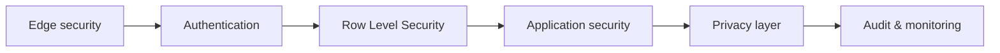

# Security Architecture

> This documents the security and privacy controls **actually implemented** in
> the OpenRelief codebase today. For proposed-but-unbuilt directions (ZK proofs,
> homomorphic encryption, multi-jurisdictional storage, HSMs), see
> [Future Vision](future-vision.md).

OpenRelief follows **defense-in-depth**: multiple independent layers must fail
before an attacker can compromise the system or a user.

## Layers (outside-in)



### 1. Edge security — `src/middleware.ts`

Next.js middleware intercepts every request and applies:

- **Security headers** — CSP, HSTS, COOP, COEP, X-Content-Type-Options, and
  more. See the `csp-violation` API route that collects browser CSP reports.
- **Rate limiting** — Redis-backed (Upstash) with an in-memory fallback.
  Tiered: limits scale with the user's trust score and progressive penalties
  for repeat offenders. (`src/lib/redis/rate-limiter.ts`)
- **Sybil detection** — behavioral, geographic, and network-cluster signals
  flag coordinated multi-account abuse before it reaches business logic.
  (`src/lib/security/sybil-detection.ts`, `sybil-prevention.ts`,
  `sybil-queries.ts`)
- **Input validation & sanitization** — `src/lib/security/input-validation.ts`
  + `isomorphic-dompurify` for HTML. Zod schemas validate request shapes.
- **Auth verification** — Supabase session validation per request.
- **Suspicious-IP blocking** and request logging.

### 2. Authentication

- **Supabase Auth** is the primary auth provider (email/password, OAuth, MFA).
- **next-auth 5 (beta)** is also wired in (`src/lib/auth.ts`) with
  `@auth/supabase-adapter`.
- JWT verification for edge contexts lives in `src/lib/auth/jwt-verify.ts`.
- The SSR Supabase client (`src/lib/supabase/server.ts`) binds the session to
  the request so RLS sees the correct user.

### 3. Row Level Security (RLS)

The **strongest** access-control boundary. RLS is enabled on every user-facing
table. Even if an attacker reached the database directly with a client key,
they can only see/modify rows where `auth.uid() = user_id` (or the
proximity-based emergency policy). See [Data Model](data-model.md) and the
full policies in [`../database/schema.md`](../database/schema.md).

### 4. Application security

API routes wrap handlers in `withAPISecurity` (`src/lib/security/api-security.ts`),
which composes rate limiting, Sybil checks, input validation, and trust
thresholds. `API_SECURITY_CONFIGS` provides per-route configuration. Trust
integration (`src/lib/security/trust-integration.ts`) gates sensitive actions
by the caller's trust score.

### 5. Privacy layer — `src/lib/privacy/`

These modules are **implemented and in use** (not aspirational):

| Module | What it does |
| --- | --- |
| `differential-privacy.ts` | Adds **Laplace noise** to location data using configurable epsilon/delta/sensitivity |
| `anonymization.ts` | **k-anonymity** generalization, temporal data decay, aggregation to protect PII |
| `cryptography.ts` | **E2E encryption** (AES-256-GCM) with scrypt key derivation, key management, identity-verification hashes |
| `transparency.ts` | Transparency-report generation, GDPR data-processing tracking |
| `notifications.ts` | Privacy-aware notification dispatch |

Database-side: `privacy_settings`, `privacy_budget`, `privacy_audit_log`,
`data_export_requests`, `data_deletion_requests`, `user_consents`, and
`encrypted_user_data` tables back these features. The
[`../privacy/implementation-guide.md`](../privacy/implementation-guide.md)
covers usage in depth.

### 6. Incident response — `src/lib/security/incident-*.ts`

A full incident-response pipeline: detection (`incident-analysis.ts`),
communications (`incident-communications.ts`), documented procedures
(`incident-procedures.ts`), and recovery (`incident-recovery.ts`). Backed by
`security_incidents`, `security_alerts`, `security_evidence`, and
`threat_intelligence` tables.

### 7. Audit & monitoring

- **Immutable audit log** — `audit_log` + `enhanced_audit_log` capture every
  mutation to sensitive tables via triggers (see `audit_trigger_function` in
  schema.md).
- **Compliance monitoring** — `src/lib/audit/compliance-monitor.ts` checks
  against `compliance_rules` and records `compliance_violations`.
- **Security monitor** — `src/lib/audit/security-monitor.ts` aggregates signals.
- **Sentry** — client, server, and edge instrumentation
  (`src/instrumentation.ts`, `instrumentation-client.ts`). See
  [`../monitoring/SENTRY_SETUP.md`](../monitoring/SENTRY_SETUP.md).

## What is **not** implemented (but sometimes claimed in old docs)

A codebase audit confirmed these have **zero source code** — they appear only
in archived design proposals. Do not assume they exist:

- ❌ Zero-knowledge proofs (zk-SNARKs, Groth16, circom)
- ❌ Homomorphic encryption (BFV / SEAL)
- ❌ Multi-jurisdictional / distributed trust storage (Shamir secret sharing)
- ❌ Hardware Security Modules (HSMs)
- ❌ Blockchain anchoring

These remain documented as a **future vision** in
[Future Vision](future-vision.md) and in [`../archive/`](../archive/).

## Security posture notes

Carried forward from the archived `trust-system-security-analysis.md`
(real findings about the as-built system):

- The trust score algorithm is **centralized in the database** (not
  zero-knowledge). This is a known trade-off: simpler and working today, but
  the service role can in principle read/modify scores. RLS + audit logging
  mitigate this. The future-vision work proposes mitigations.
- **Service-role keys** are powerful — they're kept server-side only, never
  exposed to the client, and rotated.
- **Rate limits scale with trust** — low-trust and anonymous callers face
  tighter limits, which is the primary anti-abuse lever at the edge.

## Verification commands

```bash
npm audit                 # dependency vulnerabilities
npm run test:security     # security test suite (scripts/security-test.js)
npm run lint              # ESLint (includes security-oriented rules)
```

## Related docs

- [Trust & Consensus](trust-and-consensus.md) — the trust algorithm in detail
- [`../security/implementation-guide.md`](../security/implementation-guide.md) —
  security implementation walkthrough
- [`../privacy/implementation-guide.md`](../privacy/implementation-guide.md) —
  privacy features
- [`../../SECURITY.md`](../../SECURITY.md) — vulnerability reporting policy
