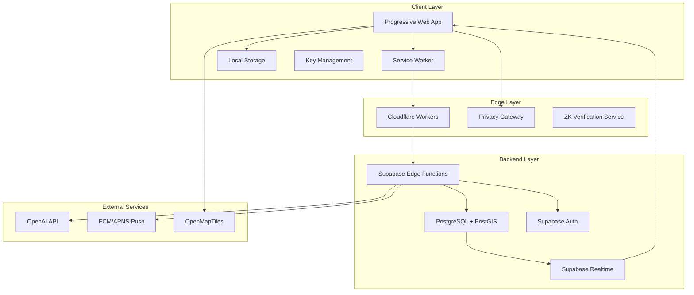
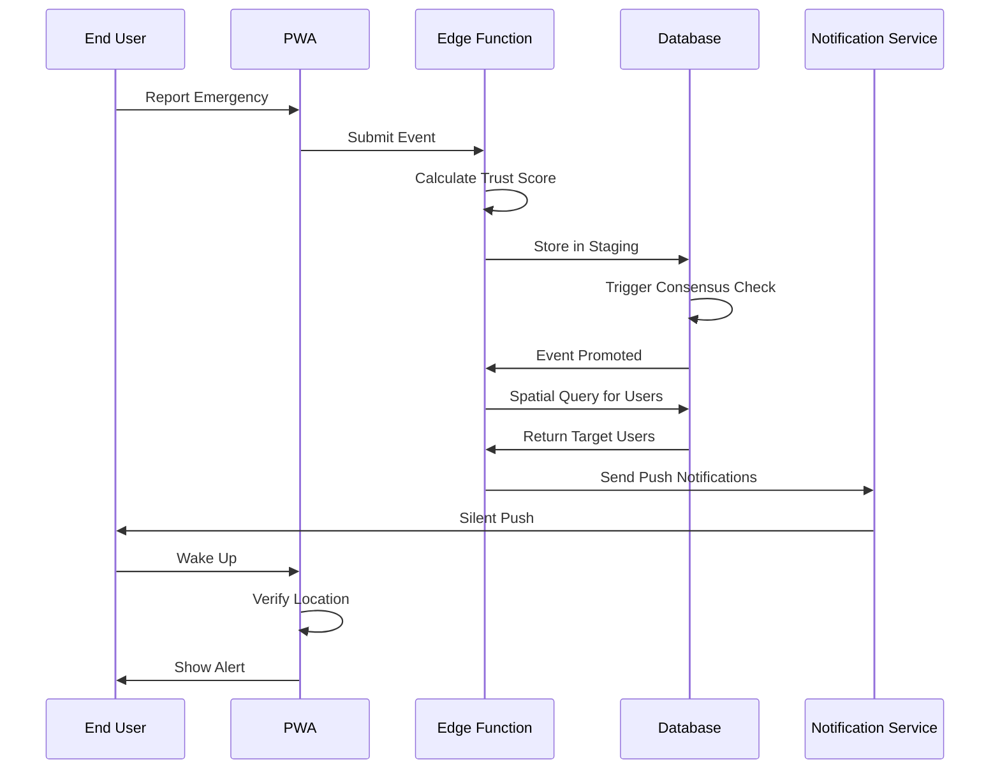
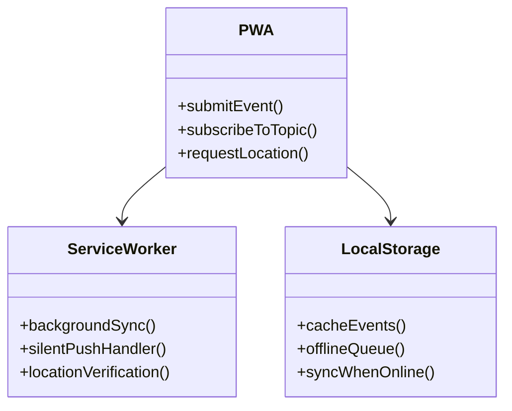
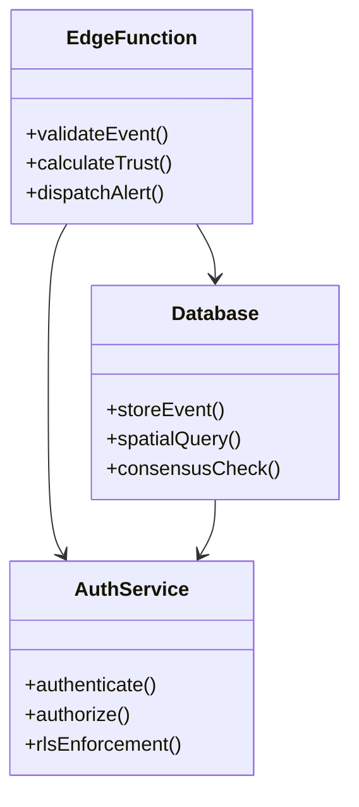
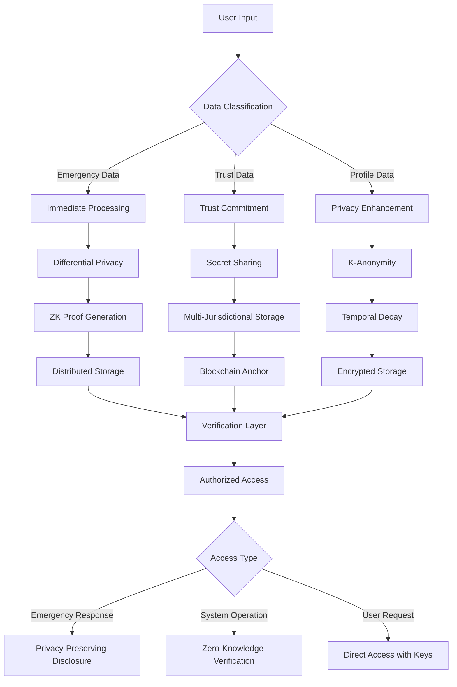
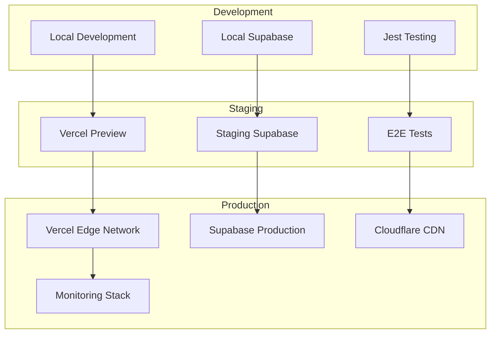
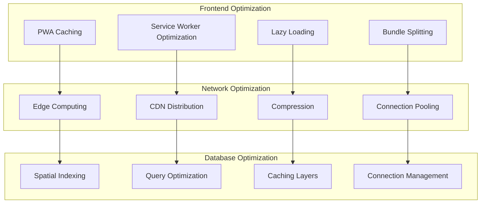
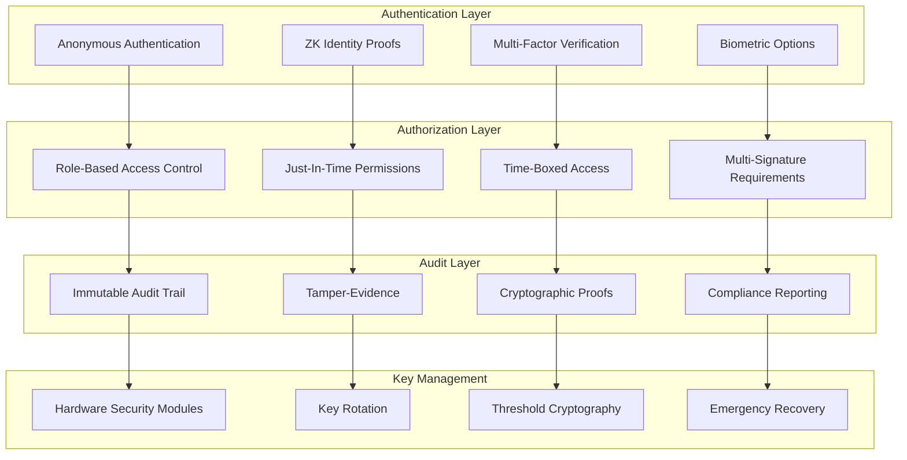
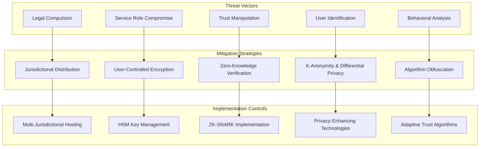

# System Architecture

## Architecture Overview

## Data Flow

## Component Relationships

### Client Layer

### Backend Layer

## Data Flow Architecture

## Deployment Architecture

## Performance Optimization Architecture

## Security Architecture

## Threat Mitigation Architecture

---

*See [technical-design.md](./technical-design.md) for specifications and [data-protection.md](./data-protection.md) for privacy architecture.*
