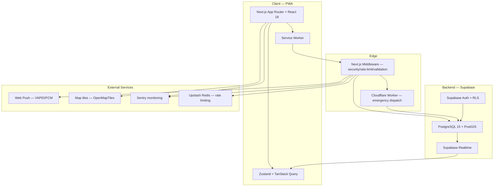
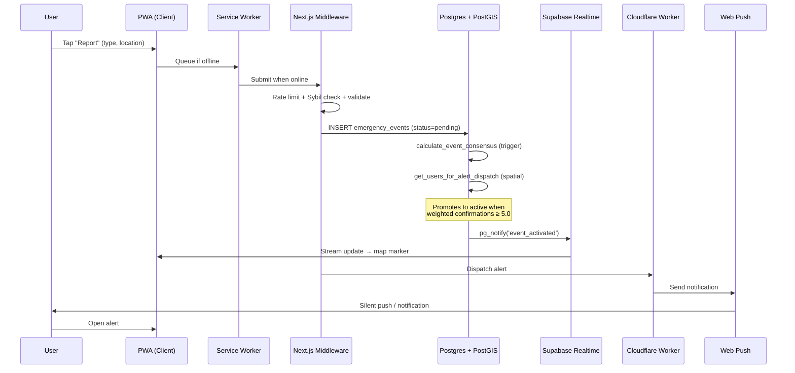
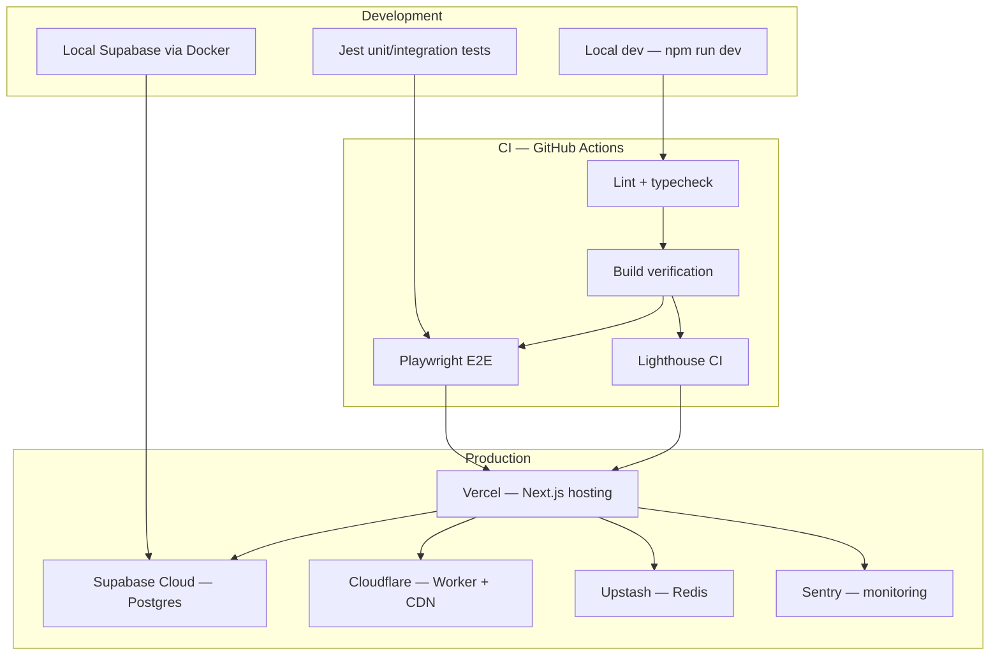
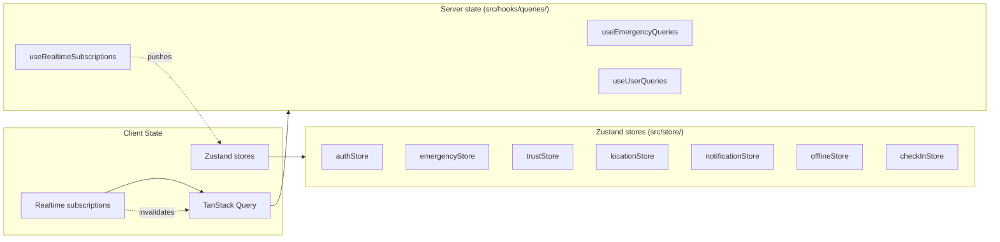
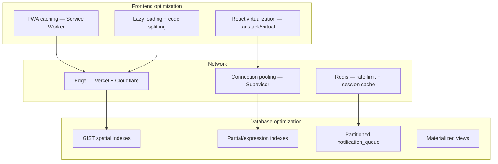

# System Diagrams

> These diagrams reflect the **current, as-built** OpenRelief architecture.
> For proposed future directions, see [Future Vision](future-vision.md).

## Overall Stack



## Emergency Report → Dispatch Data Flow



## Deployment Architecture



## Client State Architecture



## Security Request Flow

```mermaid
flowchart TD
    Req[Incoming request] -> MW{Next.js Middleware}
    MW ->|security headers| Headers[Apply CSP/HSTS/COOP/COEP]
    MW ->|rate limit| RL[Upstash Redis — tiered by trust]
    MW ->|Sybil check| Sybil[Sybil detection — behavioral/geo/network]
    MW ->|validate| Val[Input validation + sanitize]
    MW ->|auth| Auth[Supabase session verify]
    RL ->|blocked| Block[429 / 403]
    Sybil ->|flagged| Block
    Val ->|invalid| Err[400]
    Auth ->|no session| Unauth[401]
    MW ->|pass| Route[API route handler]
    Route ->|withAPISecurity| RLS[RLS-enforced Supabase client]
    RLS -> DB[(Postgres)]
```

## Performance Layer



---

*For the algorithms behind trust and consensus, see
[Trust & Consensus](trust-and-consensus.md). For the data layer, see
[Data Model](data-model.md).*
