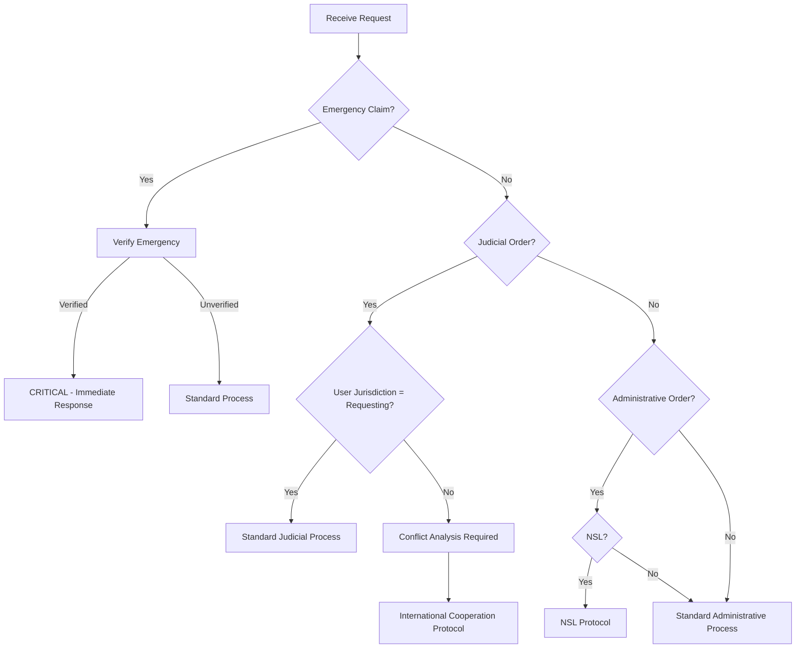
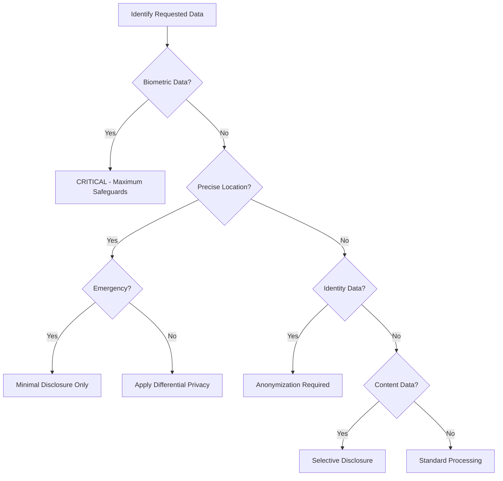

# Government Request Classification System

## Overview

This document provides a comprehensive categorization matrix for government data requests received by OpenRelief. The classification system ensures consistent handling of requests based on their legal basis, urgency, jurisdiction, and privacy impact.

## Primary Classification Categories

### 1. Request Type Classification

#### A. Judicial Orders
- **Search Warrants**: Court orders authorizing search and seizure
- **Subpoenas**: Legal orders compelling testimony or document production
- **Pen Register Orders**: Orders for dialing, routing, and signaling information
- **Wiretap Orders**: Orders for content interception
- **Court Injunctions**: Orders requiring or prohibiting specific actions

#### B. Administrative Orders
- **National Security Letters (NSLs)**: Administrative subpoenas for national security
- **Administrative Subpoenas**: Non-judicial compulsory process
- **Regulatory Orders**: Orders from regulatory agencies
- **Emergency Orders**: Orders issued without prior judicial review

#### C. Foreign Government Requests
- **MLAT Requests**: Mutual Legal Assistance Treaty requests
- **Letters Rogatory**: Formal requests for judicial assistance
- **Direct Foreign Orders**: Orders from foreign governments
- **International Treaty Requests**: Requests under international agreements

#### D. Emergency Requests
- **Imminent Threat**: Claims of immediate danger of death or serious injury
- **Emergency Disclosure**: Life-threatening situation disclosures
- **Public Safety**: Requests for public safety emergencies
- **Disaster Response**: Requests related to disaster response

### 2. Jurisdictional Classification

#### A. User's Home Jurisdiction
- **EU/EEA**: Users covered by GDPR
- **United States**: Users covered by U.S. laws
- **Canada**: Users covered by PIPEDA
- **Singapore**: Users covered by PDPA
- **Australia**: Users covered by Privacy Act
- **Other**: Users covered by other privacy regimes

#### B. Requesting Jurisdiction
- **Same as User**: Request from user's home jurisdiction
- **Different Jurisdiction**: Request from foreign jurisdiction
- **Multiple Jurisdictions**: Requests involving multiple legal frameworks
- **International Organization**: Request from international bodies

### 3. Legal Basis Classification

#### A. Criminal Investigation
- **Active Investigation**: Ongoing criminal proceedings
- **Grand Jury**: Grand jury investigations
- **Prosecutorial**: Prosecutor-led investigations
- **Law Enforcement**: Police or agency investigations

#### B. National Security
- **Counterterrorism**: Terrorism-related investigations
- **Foreign Intelligence**: Intelligence gathering activities
- **Counterintelligence**: Counterintelligence operations
- **Cybersecurity**: Cybersecurity threat investigations

#### C. Civil Proceedings
- **Litigation**: Civil lawsuits and legal proceedings
- **Regulatory Enforcement**: Regulatory agency actions
- **Administrative Proceedings**: Administrative law matters
- **Family Law**: Family law proceedings

#### D. Public Interest
- **Public Health**: Public health emergencies
- **Disaster Response**: Emergency disaster situations
- **Child Protection**: Child protection matters
- **Public Safety**: General public safety concerns

### 4. Data Type Classification

#### A. User Identity Data
- **Personal Identifiers**: Names, emails, phone numbers
- **Government Identifiers**: Social security numbers, passport numbers
- **Financial Information**: Payment information, financial records
- **Biometric Data**: Facial recognition, fingerprint data

#### B. Location Data
- **Precise Location**: GPS coordinates, precise location data
- **Historical Location**: Location history data
- **Real-time Location**: Current location information
- **Geofence Data**: Location within specific geographic areas

#### C. Content Data
- **Emergency Reports**: User-submitted emergency reports
- **Communications**: User communications and messages
- **User Generated Content**: Content created by users
- **Metadata**: Data about data (timestamps, headers, etc.)

#### D. System Data
- **Trust Scores**: User trust and reputation data
- **Usage Patterns**: System usage and interaction data
- **Technical Data**: IP addresses, device information
- **Aggregated Data**: Statistical and aggregated information

## Classification Matrix

### Priority Matrix

| Request Type | Jurisdiction | Legal Basis | Data Type | Priority Level | Response Time |
|---------------|--------------|-------------|-----------|----------------|--------------|
| Emergency Request | Same | Imminent Threat | Location | CRITICAL | 1 hour |
| NSL | Different | National Security | Identity | HIGH | 24 hours |
| Search Warrant | Same | Criminal | Content | HIGH | 48 hours |
| MLAT Request | Different | Criminal | Location | MEDIUM | 72 hours |
| Subpoena | Same | Civil | Metadata | MEDIUM | 72 hours |
| Administrative Order | Same | Regulatory | System | LOW | 5 days |
| Foreign Order | Different | Civil | Aggregated | LOW | 7 days |

### Privacy Impact Matrix

| Data Sensitivity | Request Type | Jurisdiction | Legal Basis | Impact Level | Safeguards Required |
|------------------|--------------|--------------|-------------|--------------|-------------------|
| Biometric | Any | Any | Any | CRITICAL | Maximum safeguards |
| Precise Location | Emergency | Same | Imminent Threat | HIGH | Minimal disclosure |
| Identity | NSL | Different | National Security | HIGH | Anonymization |
| Content | Warrant | Same | Criminal | MEDIUM | Selective disclosure |
| Historical Location | Subpoena | Same | Civil | MEDIUM | Temporal decay |
| Trust Scores | Administrative | Same | Regulatory | LOW | Aggregation |
| Aggregated | Foreign | Different | Civil | LOW | Differential privacy |

## Decision Trees

### Primary Classification Decision Tree

### Data Type Decision Tree

## Classification Process

### Step 1: Initial Triage (Within 1 hour)
1. Receive and log request
2. Identify request type and jurisdiction
3. Assess emergency claims
4. Assign preliminary classification
5. Notify appropriate response team

### Step 2: Detailed Analysis (Within 24 hours)
1. Complete legal review
2. Verify jurisdiction and authority
3. Identify specific data requested
4. Assess privacy impact
5. Determine applicable safeguards

### Step 3: Final Classification (Within 48 hours)
1. Confirm request classification
2. Assign priority level
3. Determine response timeline
4. Select appropriate procedures
5. Document classification rationale

## Classification Codes

### Request Type Codes
- **JW**: Judicial Warrant
- **SB**: Subpoena
- **NSL**: National Security Letter
- **ER**: Emergency Request
- **MLAT**: Mutual Legal Assistance Treaty
- **FO**: Foreign Order
- **AO**: Administrative Order

### Jurisdiction Codes
- **EU**: European Union
- **US**: United States
- **CA**: Canada
- **SG**: Singapore
- **AU**: Australia
- **OT**: Other Territory

### Priority Codes
- **1**: Critical (1 hour response)
- **2**: High (24 hour response)
- **3**: Medium (72 hour response)
- **4**: Low (5-7 day response)

### Data Type Codes
- **BIO**: Biometric Data
- **LOC**: Location Data
- **ID**: Identity Data
- **CONT**: Content Data
- **SYS**: System Data
- **AGG**: Aggregated Data

### Example Classification
- **Request**: NSL from US for user location data
- **Classification**: NSL-US-LOC-2
- **Interpretation**: National Security Letter from United States requesting Location Data with High Priority

## Quality Assurance

### Classification Review Requirements
- **Self-Assessment**: Request handler must verify classification
- **Peer Review**: All classifications reviewed by second qualified staff
- **Supervisor Approval**: Priority 1-2 classifications require supervisor approval
- **Legal Review**: All classifications must be reviewed by legal counsel

### Classification Accuracy Metrics
- **Target**: 95% classification accuracy
- **Measurement**: Quarterly audit of classification decisions
- **Improvement**: Regular training updates based on classification errors

## Integration with Response Protocols

### Automated Classification Support
- **Request Parsing**: Automated extraction of key classification factors
- **Jurisdiction Detection**: Automatic identification of user and requesting jurisdictions
- **Data Type Analysis**: Technical analysis of requested data types
- **Priority Assignment**: Automated priority level recommendations

### Classification-Based Routing
- **Critical Requests**: Immediate escalation to senior legal team
- **High Priority**: Direct routing to specialized legal counsel
- **Medium Priority**: Standard legal team assignment
- **Low Priority**: Routine processing with standard timelines

## Training and Documentation

### Classification Training Requirements
- **Initial Training**: Comprehensive classification system training for all legal staff
- **Refresher Training**: Quarterly classification updates and scenario exercises
- **Specialized Training**: Advanced training for complex jurisdictional issues
- **Cross-Training**: Basic classification awareness for technical staff

### Documentation Requirements
- **Classification Log**: Complete record of all classification decisions
- **Rationale Documentation**: Detailed reasoning for each classification
- **Appeal Process**: Process for challenging classification decisions
- **Update Process**: Procedure for updating classification criteria

## Review and Update Process

### Regular Review Schedule
- **Monthly**: Classification accuracy metrics review
- **Quarterly**: Classification criteria and process review
- **Semi-Annually**: Full classification system evaluation
- **Annually**: Comprehensive classification system update

### Update Triggers
- **Legal Changes**: New laws or legal precedents
- **Operational Issues**: Classification errors or process problems
- **Technology Changes**: New data types or technical capabilities
- **Jurisdictional Changes**: New privacy regimes or requirements

This classification system should be regularly reviewed and updated to ensure it remains effective and compliant with evolving legal requirements and operational needs.