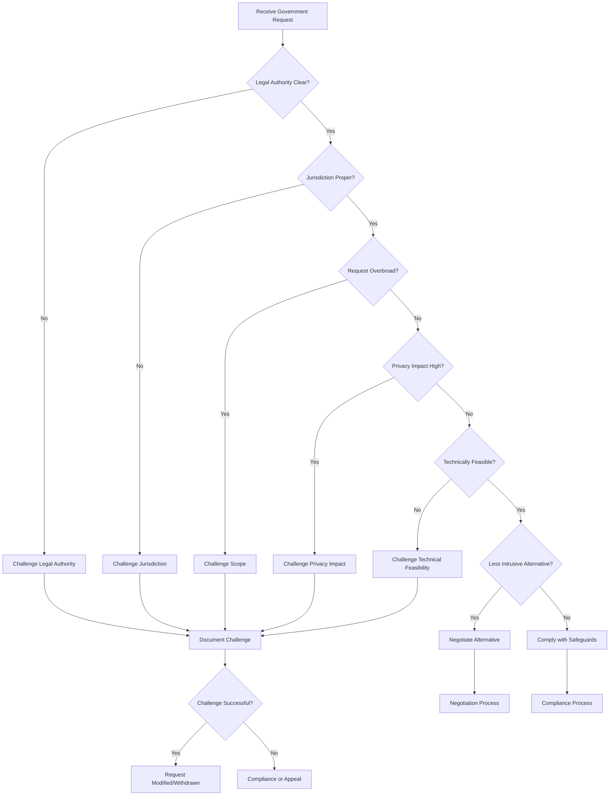
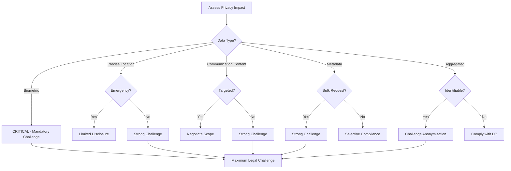
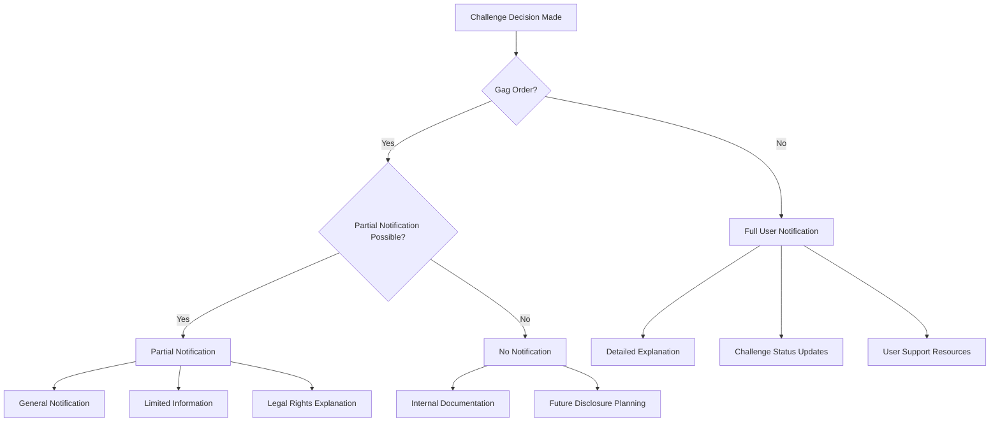

# Legal Challenge Criteria and Decision Trees

## Overview

This document outlines the criteria and decision-making framework for determining when and how to challenge government data requests. The procedures are designed to protect user privacy while ensuring compliance with legitimate legal obligations.

## Challenge Philosophy and Principles

### Core Principles

1. **User Privacy First**: Prioritize user privacy and rights over compliance when legally permissible
2. **Proportionality Assessment**: Challenge requests that are overly broad or disproportionate
3. **Jurisdictional Compliance**: Respect legitimate legal authority while challenging overreach
4. **Transparency**: Document challenge decisions and rationale where legally permitted
5. **Precedent Setting**: Consider broader implications for user rights and privacy

### Strategic Considerations

#### When to Challenge
- **Legal Uncertainty**: Requests based on unclear or evolving legal standards
- **Overbroad Scope**: Requests that exceed legitimate investigative needs
- **Jurisdictional Overreach**: Requests from inappropriate jurisdictions
- **Technical Impracticability**: Requests that cannot be technically implemented
- **Privacy Violations**: Requests that would violate privacy commitments

#### When to Comply
- **Clear Legal Authority**: Requests with unambiguous legal basis
- **Narrowly Tailored**: Requests that are specific and limited in scope
- **Emergency Situations**: Legitimate emergency disclosures
- **Court Validated**: Requests that have survived judicial scrutiny
- **Proportionate**: Requests that balance investigative needs with privacy

## Challenge Criteria Framework

### 1. Legal Validity Criteria

#### A. Jurisdictional Authority
- **Proper Jurisdiction**: Request from authority with proper jurisdiction
- **Legal Basis**: Clear legal basis for the request
- **Proper Service**: Correct service of process and notification
- **Authority Limits**: Request within requesting authority's legal limits

**Challenge Triggers:**
- Request from jurisdiction without authority
- Unclear or insufficient legal basis
- Improper service or notification
- Request exceeding authority limits

#### B. Procedural Requirements
- **Due Process**: Request complies with due process requirements
- **Specificity**: Request is sufficiently specific
- **Relevance**: Requested information is relevant to investigation
- **Timeliness**: Request is timely and not stale

**Challenge Triggers:**
- Due process violations
- Overly broad or vague requests
- Irrelevant information requests
- Untimely or stale requests

### 2. Privacy Impact Criteria

#### A. Data Sensitivity
- **Highly Sensitive Data**: Biometric, health, financial information
- **Location Data**: Precise location information
- **Communications Content**: Content of private communications
- **Association Data**: Information about associations and relationships

**Challenge Triggers:**
- Requests for highly sensitive data without proper justification
- Broad location data requests
- Fishing expeditions for communication content
- Requests that would reveal private associations

#### B. Scope and Scale
- **Bulk Data Requests**: Requests for large volumes of user data
- **Indiscriminate Collection**: Non-targeted data collection
- **Time Period**: Excessively long time periods
- **User Scope**: Large numbers of affected users

**Challenge Triggers:**
- Bulk data requests without specific justification
- Indiscriminate or non-targeted requests
- Excessively long time periods
- Requests affecting large numbers of users

### 3. Technical Feasibility Criteria

#### A. Implementation Complexity
- **Technical Capability**: Request can be technically implemented
- **System Impact**: Request won't compromise system security
- **Data Availability**: Requested data actually exists and is accessible
- **Resource Requirements**: Reasonable resource requirements

**Challenge Triggers:**
- Technically impossible requests
- Requests that compromise system security
- Requests for non-existent data
- Unreasonable resource requirements

#### B. Privacy Preserving Alternatives
- **Less Intrusive Methods**: Less privacy-invasive alternatives exist
- **Anonymized Data**: Anonymized data would suffice
- **Selective Disclosure**: Partial disclosure would meet needs
- **Alternative Sources**: Information available from other sources

**Challenge Triggers:**
- Less intrusive alternatives available
- Anonymized data would meet investigative needs
- Selective disclosure possible
- Alternative information sources available

## Decision Trees

### Primary Challenge Decision Tree

### Privacy Impact Assessment Tree

## Challenge Procedures by Request Type

### 1. National Security Letters (NSLs)

#### Challenge Considerations
- **Legal Basis**: Limited challenge grounds under current law
- **Gag Orders**: Restrictions on discussing NSL receipt
- **Scope**: Potential to challenge overbroad requests
- **Constitutional Issues**: First Amendment challenges where applicable

#### Challenge Strategy
1. **Initial Assessment**
   - Verify NSL authenticity and authority
   - Assess scope and specificity
   - Document all aspects without violating gag order
   - Consult with specialized national security counsel

2. **Limited Challenge Options**
   - Challenge overbroad scope where permitted
   - Seek judicial review if statutory grounds exist
   - Negotiate scope reduction where possible
   - Document all challenge attempts

3. **Compliance with Safeguards**
   - Minimize data disclosure to absolute minimum
   - Apply all technical privacy protections
   - Maintain internal documentation for future disclosure
   - Prepare for eventual public disclosure when permitted

### 2. Search Warrants

#### Challenge Considerations
- **Particularity Requirement**: Fourth Amendment particularity challenges
- **Probable Cause**: Challenge lack of probable cause
- **Scope Limitations**: Challenge overbroad or general warrants
- **Timing Issues**: Challenge stale or untimely warrants

#### Challenge Strategy
1. **Immediate Review**
   - Verify warrant authenticity and proper issuance
   - Assess particularity and specificity
   - Evaluate probable cause basis
   - Check for proper timing and scope

2. **Legal Challenges**
   - File motion to quash for lack of particularity
   - Challenge probable cause if insufficient
   - Seek modification of overbroad scope
   - Assert privilege claims where applicable

3. **Technical Safeguards**
   - Implement narrow compliance with challenged portions
   - Apply privacy-preserving technical measures
   - Document technical limitations on compliance
   - Prepare for appellate review if necessary

### 3. Subpoenas

#### Challenge Considerations
- **Relevance**: Challenge relevance of requested information
- **Burden**: Challenge undue burden or oppression
- **Privilege**: Assert applicable privilege claims
- **Jurisdiction**: Challenge proper jurisdiction and service

#### Challenge Strategy
1. **Substantive Challenges**
   - File motion to quash for relevance issues
   - Challenge undue burden or oppression
   - Assert attorney-client, doctor-patient, or other privileges
   - Challenge jurisdiction and service issues

2. **Negotiated Solutions**
   - Seek protective orders for sensitive information
   - Negotiate scope reduction
   - Propose alternative production methods
   - Agree on confidentiality provisions

3. **Selective Compliance**
   - Comply with valid portions while challenging invalid portions
   - Implement privacy protections for disclosed information
   - Document compliance and challenge positions
   - Prepare for enforcement proceedings

### 4. Foreign Government Requests

#### Challenge Considerations
- **Jurisdictional Authority**: Challenge extraterritorial claims
- **Comity Principles**: Assert international comity principles
- **MLAT Requirements**: Require proper MLAT procedures
- **Human Rights**: Challenge violations of international human rights

#### Challenge Strategy
1. **Jurisdictional Challenges**
   - Assert lack of jurisdiction over foreign users
   - Challenge extraterritorial application of foreign laws
   - Require compliance with MLAT procedures
   - Invoke international human rights principles

2. **Compliance Negotiations**
   - Negotiate through diplomatic channels
   - Seek mutual legal assistance procedures
   - Propose privacy-preserving alternatives
   - Coordinate with home government authorities

3. **Protective Measures**
   - Implement jurisdictional data segregation
   - Apply technical barriers to cross-border data transfer
   - Document legal compliance and resistance efforts
   - Prepare for international dispute resolution

## Legal Resource Allocation

### Challenge Resource Matrix

| Challenge Type | Legal Complexity | Time Required | Cost Estimate | Success Probability |
|----------------|------------------|---------------|---------------|-------------------|
| NSL Scope | High | 3-6 months | $50,000-100,000 | Low-Medium |
| Warrant Particularity | Medium | 1-3 months | $25,000-50,000 | Medium |
| Subpoena Relevance | Low-Medium | 1-2 months | $10,000-25,000 | Medium-High |
| Foreign Jurisdiction | High | 6-12 months | $100,000-200,000 | Low-Medium |
| Constitutional Challenge | Very High | 1-3 years | $500,000-1,000,000 | Low |

### Resource Allocation Criteria

#### High Priority Challenges
- **Clear Legal Merit**: Strong legal basis for challenge
- **High Privacy Impact**: Significant privacy implications
- **Precedent Value**: Potential to establish important precedent
- **User Support**: Strong user support for challenge
- **Resource Availability**: Sufficient resources to pursue challenge

#### Medium Priority Challenges
- **Moderate Legal Merit**: Reasonable legal basis for challenge
- **Medium Privacy Impact**: Moderate privacy implications
- **Limited Precedent Value**: Some precedent potential
- **Mixed User Support**: Some user support for challenge
- **Limited Resources**: Resource constraints may limit challenge

#### Low Priority Challenges
- **Weak Legal Merit**: Limited legal basis for challenge
- **Low Privacy Impact**: Minimal privacy implications
- **No Precedent Value**: No precedent potential
- **Limited User Support**: Little user support for challenge
- **Resource Constraints**: Insufficient resources for challenge

## User Notification and Support

### Notification Decision Tree

### User Support Framework

#### Notification Templates
- **Challenge Initiation**: Initial notification of challenge decision
- **Progress Updates**: Regular updates on challenge progress
- **Outcome Notification**: Final result of challenge proceedings
- **Rights Explanation**: User rights and options explanation

#### Support Resources
- **Legal Referrals**: Referrals to qualified legal counsel
- **Support Organizations**: Privacy and civil liberties organizations
- **Educational Materials**: Information about legal issues
- **Community Support**: User community and advocacy groups

## Documentation and Record-Keeping

### Challenge Documentation Requirements

#### Legal Documentation
- **Challenge Filings**: Copies of all legal challenge documents
- **Court Orders**: Copies of all court orders and decisions
- **Legal Correspondence**: All legal correspondence related to challenge
- **Legal Analysis**: Internal legal analysis and strategy documents

#### Technical Documentation
- **Implementation Details**: Technical implementation of challenge compliance
- **Data Handling**: Documentation of data handling during challenge
- **System Impact**: Impact of challenge on system operations
- **Privacy Measures**: Privacy protection measures implemented

#### Business Documentation
- **Resource Allocation**: Documentation of resource allocation decisions
- **Cost Tracking**: Tracking of challenge costs and expenses
- **Impact Assessment**: Business impact assessment of challenge
- **Strategic Decisions**: Strategic decision-making documentation

### Record Retention Policies

#### Retention Periods
- **Challenge Records**: Permanent retention of challenge records
- **Legal Analysis**: 10-year retention of legal analysis documents
- **Technical Documentation**: 7-year retention of technical documentation
- **Business Records**: 7-year retention of business records

#### Access Controls
- **Restricted Access**: Limited access to challenge documentation
- **Need-to-Know**: Access based on need-to-know basis
- **Legal Privilege**: Protection of privileged communications
- **Security Measures**: Appropriate security measures for sensitive records

## Review and Improvement

### Challenge Effectiveness Review

#### Metrics for Success
- **Challenge Success Rate**: Percentage of successful challenges
- **Privacy Protection**: Level of privacy protection achieved
- **Cost Effectiveness**: Cost-benefit analysis of challenges
- **User Satisfaction**: User satisfaction with challenge efforts

#### Regular Review Process
- **Quarterly Reviews**: Quarterly review of ongoing challenges
- **Annual Assessment**: Annual assessment of challenge strategy
- **Case Studies**: Detailed analysis of significant challenges
- **Strategy Updates**: Updates to challenge strategy based on experience

### Continuous Improvement

#### Learning from Experience
- **Success Analysis**: Analysis of successful challenges
- **Failure Analysis**: Analysis of unsuccessful challenges
- **Best Practices**: Development of best practices based on experience
- **Knowledge Sharing**: Sharing of challenge knowledge and experience

#### Strategy Evolution
- **Legal Developments**: Incorporation of new legal developments
- **Technology Changes**: Adaptation to new technological capabilities
- **Privacy Evolution**: Evolution of privacy protection strategies
- **User Expectations**: Adaptation to changing user expectations

This legal challenge framework provides a comprehensive approach to protecting user privacy while navigating complex legal requirements. Regular review and updates ensure the framework remains effective and responsive to evolving legal and technological landscapes.