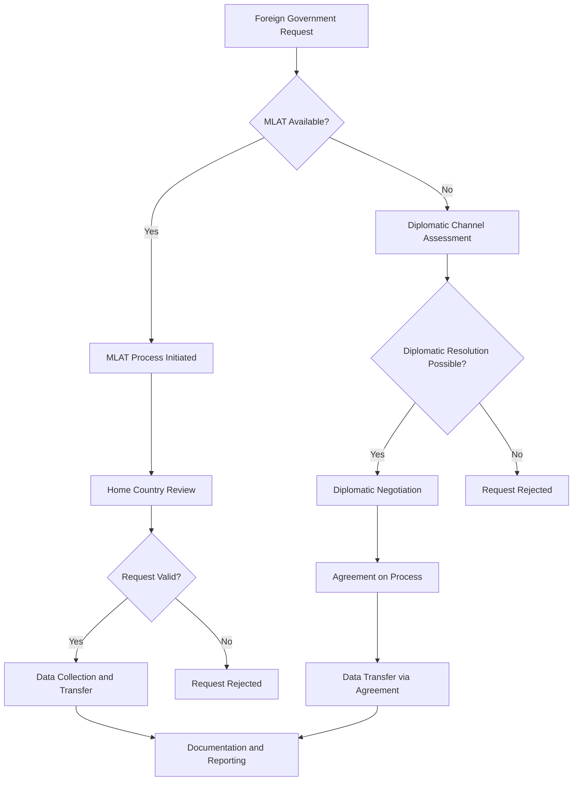

# Cross-Border Request Handling Framework

## Overview

This document outlines the framework for handling cross-border government data requests while maintaining compliance with multiple jurisdictions and protecting user privacy. The framework addresses the complex legal landscape of international data requests and provides clear procedures for lawful compliance.

## Jurisdictional Analysis

### Primary Jurisdictions

#### European Union (GDPR)
- **Data Transfer Restrictions**: Strict limitations on cross-border data transfers
- **Adequacy Requirements**: Transfers only to adequate jurisdictions or with safeguards
- **User Rights**: Strong user rights for international data transfers
- **Government Access**: Judicial authorization required for government access

#### United States (CLOUD Act)
- **Extraterritorial Reach**: U.S. law applies to data controlled by U.S. companies
- **Government Access**: Broad government access powers
- **International Cooperation**: Executive agreements for cross-border requests
- **User Notification**: Limited user notification requirements

#### Canada (PIPEDA)
- **Reasonable Safeguards**: Cross-border transfers require reasonable safeguards
- **Consent Requirements**: Meaningful consent required for international transfers
- **Government Access**: Court orders and warrants required
- **User Rights**: Access and correction rights maintained

#### Singapore (PDPA)
- **Transfer Limitations**: Transfers only to countries with comparable protection
- **Consent Requirements**: Consent required for international transfers
- **Government Access**: Official investigations with proper authority
- **User Rights**: Access and correction rights protected

#### Australia (Privacy Act)
- **APP 8 Requirements**: Cross-border disclosure requirements
- **Reasonable Steps**: Steps to protect data overseas
- **Government Access**: Warrants and subpoenas required
- **User Rights**: Access and correction rights maintained

## Request Types and Procedures

### 1. Mutual Legal Assistance Treaty (MLAT) Requests

#### MLAT Process Overview


#### MLAT Implementation Procedures
1. **Initial Assessment (Within 24 hours)**
   - Verify MLAT applicability between jurisdictions
   - Assess request validity and specificity
   - Identify applicable legal frameworks
   - Document initial assessment

2. **Home Country Coordination (Within 48 hours)**
   - Contact appropriate home country authorities
   - Submit request through official MLAT channels
   - Provide supporting documentation and evidence
   - Establish communication protocols

3. **Request Processing (Within 14-30 days)**
   - Home country authorities review request
   - Legal validation and approval process
   - Data collection and preparation
   - Secure transfer mechanisms

4. **Data Transfer and Documentation**
   - Secure data transfer to requesting authority
   - Complete transfer documentation
   - Update transparency reporting systems
   - Notify users where legally permitted

### 2. Direct Foreign Government Requests

#### Direct Request Handling Framework
```typescript
interface DirectForeignRequest {
  id: string;
  requestingCountry: string;
  requestingAuthority: string;
  legalBasis: string;
  dataScope: DataScope;
  urgencyLevel: 'low' | 'medium' | 'high' | 'critical';
  receivedDate: Date;
  supportingDocuments: Document[];
}

class DirectForeignRequestHandler {
  // Process direct foreign government request
  async processDirectRequest(
    request: DirectForeignRequest
  ): Promise<RequestProcessingResult> {
    // Step 1: Jurisdictional Analysis
    const jurisdictionalAnalysis = await this.analyzeJurisdictionalIssues(request);
    
    if (jurisdictionalAnalysis.hasConflict) {
      return await this.handleJurisdictionalConflict(request, jurisdictionalAnalysis);
    }
    
    // Step 2: Legal Validity Assessment
    const legalAssessment = await this.assessLegalValidity(request);
    
    if (!legalAssessment.isValid) {
      return await this.rejectInvalidRequest(request, legalAssessment);
    }
    
    // Step 3: Compliance Path Determination
    const compliancePath = await this.determineCompliancePath(request);
    
    switch (compliancePath.type) {
      case 'MLAT':
        return await this.processViaMLAT(request, compliancePath);
      case 'DIPLOMATIC':
        return await this.processViaDiplomaticChannel(request, compliancePath);
      case 'DIRECT':
        return await this.processDirectly(request, compliancePath);
      default:
        return await this.rejectRequest(request, 'No valid compliance path');
    }
  }
  
  // Analyze jurisdictional conflicts
  private async analyzeJurisdictionalIssues(
    request: DirectForeignRequest
  ): Promise<JurisdictionalAnalysis> {
    const userJurisdiction = await this.determineUserJurisdiction(request.dataScope);
    const requestingJurisdiction = request.requestingCountry;
    
    // Check for jurisdictional conflicts
    const hasConflict = await this.checkJurisdictionalConflict(
      userJurisdiction,
      requestingJurisdiction
    );
    
    // Analyze applicable legal frameworks
    const applicableLaws = await this.identifyApplicableLaws(
      userJurisdiction,
      requestingJurisdiction
    );
    
    // Assess conflict resolution options
    const resolutionOptions = await this.identifyResolutionOptions(
      hasConflict,
      applicableLaws
    );
    
    return {
      userJurisdiction,
      requestingJurisdiction,
      hasConflict,
      applicableLaws,
      resolutionOptions
    };
  }
}
```

### 3. Executive Agreement Requests

#### Executive Agreement Framework
```typescript
interface ExecutiveAgreement {
  id: string;
  agreementType: 'CLOUD_Act_Executive_Agreement' | 'Bilateral_Data_Sharing';
  participatingCountries: string[];
  dataTypes: string[];
  safeguards: Safeguard[];
  oversightMechanisms: OversightMechanism[];
  effectiveDate: Date;
  expirationDate: Date;
}

class ExecutiveAgreementHandler {
  // Process request under executive agreement
  async processExecutiveAgreementRequest(
    request: GovernmentRequest,
    agreement: ExecutiveAgreement
  ): Promise<AgreementProcessingResult> {
    // Verify agreement applicability
    const isApplicable = await this.verifyAgreementApplicability(request, agreement);
    if (!isApplicable) {
      throw new Error('Executive agreement not applicable to this request');
    }
    
    // Check agreement validity
    const isValid = await this.verifyAgreementValidity(agreement);
    if (!isValid) {
      throw new Error('Executive agreement is no longer valid');
    }
    
    // Apply agreement safeguards
    const safeguardedRequest = await this.applyAgreementSafeguards(
      request,
      agreement
    );
    
    // Process request under agreement terms
    const result = await this.processUnderAgreementTerms(
      safeguardedRequest,
      agreement
    );
    
    // Document agreement usage
    await this.documentAgreementUsage(request, agreement, result);
    
    return result;
  }
  
  // Apply agreement safeguards
  private async applyAgreementSafeguards(
    request: GovernmentRequest,
    agreement: ExecutiveAgreement
  ): Promise<SafeguardedRequest> {
    const safeguardedRequest: SafeguardedRequest = {
      originalRequest: request,
      appliedSafeguards: [],
      modifiedDataScope: request.dataScope,
      additionalRequirements: []
    };
    
    // Apply each safeguard in the agreement
    for (const safeguard of agreement.safeguards) {
      const result = await this.applySafeguard(request, safeguard);
      safeguardedRequest.appliedSafeguards.push(result);
      safeguardedRequest.modifiedDataScope = result.modifiedDataScope;
    }
    
    // Add oversight requirements
    for (const oversight of agreement.oversightMechanisms) {
      const requirement = await this.generateOversightRequirement(request, oversight);
      safeguardedRequest.additionalRequirements.push(requirement);
    }
    
    return safeguardedRequest;
  }
}
```

## Jurisdictional Conflict Resolution

### Conflict Resolution Framework

#### Conflict Identification
1. **Direct Conflict**: Laws directly conflict (e.g., disclosure prohibition vs. disclosure requirement)
2. **Procedural Conflict**: Different procedural requirements for similar requests
3. **Standard Conflict**: Different privacy standards or requirements
4. **Enforcement Conflict**: Different enforcement mechanisms or penalties

#### Resolution Strategies

##### 1. Comity-Based Resolution
- **Principle**: Respect for foreign legal systems while protecting home jurisdiction interests
- **Application**: Balance competing interests through diplomatic negotiation
- **Process**: Formal comity analysis with documented reasoning
- **Outcome**: Mutually acceptable resolution through negotiation

##### 2. Most Protective Standard
- **Principle**: Apply the most protective legal standard available
- **Application**: Choose jurisdiction with strongest privacy protections
- **Process**: Document comparative legal analysis
- **Outcome**: Maximum user privacy protection

##### 3. Territoriality-Based Resolution
- **Principle**: Apply law of territory where data is located
- **Application**: Data localization and territorial compliance
- **Process**: Implement territorial data segregation
- **Outcome**: Clear jurisdictional application

##### 4. International Law Resolution
- **Principle**: Apply international law principles and treaties
- **Application**: Use international human rights frameworks
- **Process**: Document international legal basis
- **Outcome**: Internationally recognized resolution

### Conflict Resolution Process
```typescript
class JurisdictionalConflictResolver {
  // Resolve jurisdictional conflicts
  async resolveConflict(
    conflict: JurisdictionalConflict
  ): Promise<ConflictResolution> {
    // Analyze conflict type and severity
    const conflictAnalysis = await this.analyzeConflict(conflict);
    
    // Identify resolution strategies
    const resolutionStrategies = await this.identifyResolutionStrategies(
      conflictAnalysis
    );
    
    // Evaluate each strategy
    const strategyEvaluations = await Promise.all(
      resolutionStrategies.map(strategy => this.evaluateStrategy(strategy, conflict))
    );
    
    // Select optimal strategy
    const optimalStrategy = await this.selectOptimalStrategy(
      strategyEvaluations
    );
    
    // Implement resolution strategy
    const resolution = await this implementResolutionStrategy(
      optimalStrategy,
      conflict
    );
    
    // Document resolution process
    await this.documentResolutionProcess(conflict, resolution);
    
    return resolution;
  }
  
  // Evaluate resolution strategy
  private async evaluateStrategy(
    strategy: ResolutionStrategy,
    conflict: JurisdictionalConflict
  ): Promise<StrategyEvaluation> {
    // Legal compliance assessment
    const legalCompliance = await this.assessLegalCompliance(
      strategy,
      conflict
    );
    
    // Privacy impact assessment
    const privacyImpact = await this.assessPrivacyImpact(
      strategy,
      conflict
    );
    
    // Practical feasibility assessment
    const feasibility = await this.assessFeasibility(strategy, conflict);
    
    // Risk assessment
    const riskAssessment = await this.assessRisk(strategy, conflict);
    
    return {
      strategy,
      legalCompliance,
      privacyImpact,
      feasibility,
      riskAssessment,
      overallScore: this.calculateOverallScore(
        legalCompliance,
        privacyImpact,
        feasibility,
        riskAssessment
      )
    };
  }
}
```

## Data Transfer Mechanisms

### Secure Transfer Protocols

#### 1. Encrypted Transfer Channels
```typescript
class SecureDataTransfer {
  // Secure cross-border data transfer
  async secureTransfer(
    data: EncryptedData,
    recipient: RecipientInfo,
    transferContext: TransferContext
  ): Promise<TransferResult> {
    // Verify recipient authorization
    const isAuthorized = await this.verifyRecipientAuthorization(
      recipient,
      transferContext
    );
    if (!isAuthorized) {
      throw new Error('Recipient not authorized for data transfer');
    }
    
    // Apply transfer-specific encryption
    const transferEncrypted = await this.applyTransferEncryption(
      data,
      recipient,
      transferContext
    );
    
    // Create secure transfer channel
    const secureChannel = await this.establishSecureChannel(recipient);
    
    // Execute transfer with integrity verification
    const transferResult = await this.executeTransfer(
      transferEncrypted,
      secureChannel
    );
    
    // Verify transfer integrity
    const integrityVerified = await this.verifyTransferIntegrity(
      transferResult
    );
    
    if (!integrityVerified) {
      throw new Error('Transfer integrity verification failed');
    }
    
    // Document transfer
    await this.documentTransfer(data, recipient, transferResult);
    
    return transferResult;
  }
  
  // Apply transfer-specific encryption
  private async applyTransferEncryption(
    data: EncryptedData,
    recipient: RecipientInfo,
    context: TransferContext
  ): Promise<TransferEncryptedData> {
    // Generate transfer-specific key
    const transferKey = await this.generateTransferKey(recipient, context);
    
    // Encrypt data for transfer
    const encryptedForTransfer = await this.encryptForTransfer(
      data,
      transferKey
    );
    
    // Create key transfer mechanism
    const keyTransfer = await this.createKeyTransfer(transferKey, recipient);
    
    return {
      encryptedData: encryptedForTransfer,
      keyTransfer: keyTransfer,
      transferMetadata: {
        recipient: recipient.id,
        transferId: this.generateTransferId(),
        timestamp: new Date(),
        encryptionAlgorithm: 'AES-256-GCM',
        keyExchangeAlgorithm: 'ECDH'
      }
    };
  }
}
```

#### 2. Jurisdictional Data Segregation
```typescript
class JurisdictionalDataSegregation {
  // Store data according to jurisdictional requirements
  async storeDataByJurisdiction(
    userId: string,
    data: UserData,
    userJurisdiction: string
  ): Promise<StorageResult> {
    // Determine storage requirements for jurisdiction
    const storageRequirements = await this.getStorageRequirements(
      userJurisdiction
    );
    
    // Select appropriate storage location
    const storageLocation = await this.selectStorageLocation(
      userJurisdiction,
      storageRequirements
    );
    
    // Apply jurisdiction-specific protections
    const protectedData = await this.applyJurisdictionalProtections(
      data,
      userJurisdiction,
      storageRequirements
    );
    
    // Store data in selected location
    const storageResult = await this.storeData(
      protectedData,
      storageLocation
    );
    
    // Document storage decision
    await this.documentStorageDecision(
      userId,
      userJurisdiction,
      storageLocation,
      storageRequirements
    );
    
    return storageResult;
  }
  
  // Retrieve data with jurisdictional compliance
  async retrieveDataWithCompliance(
    userId: string,
    requestorJurisdiction: string,
    requestContext: RequestContext
  ): Promise<RetrievalResult> {
    // Determine user's data jurisdiction
    const userJurisdiction = await this.determineUserJurisdiction(userId);
    
    // Assess cross-border transfer requirements
    const transferRequirements = await this.assessTransferRequirements(
      userJurisdiction,
      requestorJurisdiction,
      requestContext
    );
    
    if (transferRequirements.requiresMLAT) {
      throw new Error('MLAT process required for this transfer');
    }
    
    if (transferRequirements.prohibited) {
      throw new Error('Cross-border transfer prohibited for this request');
    }
    
    // Apply transfer safeguards
    const safeguards = await this.determineTransferSafeguards(
      transferRequirements
    );
    
    // Retrieve and protect data
    const data = await this.retrieveData(userId, safeguards);
    
    // Apply transfer protections
    const protectedData = await this.applyTransferProtections(
      data,
      transferRequirements
    );
    
    return protectedData;
  }
}
```

## Oversight and Accountability

### International Oversight Mechanisms

#### 1. Joint Oversight Committees
```typescript
interface JointOversightCommittee {
  id: string;
  participatingJurisdictions: string[];
  mandate: string;
  meetingFrequency: string;
  reportingRequirements: ReportingRequirement[];
  disputeResolutionMechanisms: DisputeResolutionMechanism[];
}

class InternationalOversightManager {
  // Manage joint oversight activities
  async manageOversightActivities(
    committee: JointOversightCommittee
  ): Promise<OversightResult> {
    // Schedule regular oversight meetings
    const meetingSchedule = await this.scheduleOversightMeetings(committee);
    
    // Prepare oversight reports
    const oversightReports = await this.prepareOversightReports(committee);
    
    // Conduct compliance reviews
    const complianceReviews = await this.conductComplianceReviews(committee);
    
    // Handle disputes and conflicts
    const disputeResolutions = await this.handleDisputes(committee);
    
    // Document oversight activities
    await this.documentOversightActivities({
      committee: committee.id,
      meetings: meetingSchedule,
      reports: oversightReports,
      reviews: complianceReviews,
      disputes: disputeResolutions
    });
    
    return {
      meetings: meetingSchedule,
      reports: oversightReports,
      reviews: complianceReviews,
      disputes: disputeResolutions
    };
  }
}
```

#### 2. Transparency Reporting
```typescript
class InternationalTransparencyReporter {
  // Generate international transparency report
  async generateInternationalTransparencyReport(
    reportingPeriod: DateRange
  ): Promise<InternationalTransparencyReport> {
    // Collect cross-border request data
    const crossBorderRequests = await this.collectCrossBorderRequests(
      reportingPeriod
    );
    
    // Analyze jurisdictional patterns
    const jurisdictionalAnalysis = await this.analyzeJurisdictionalPatterns(
      crossBorderRequests
    );
    
    // Assess compliance with international agreements
    const complianceAssessment = await this.assessAgreementCompliance(
      crossBorderRequests
    );
    
    // Document challenges and resolutions
    const challengeDocumentation = await this.documentChallengesAndResolutions(
      crossBorderRequests
    );
    
    return {
      reportingPeriod,
      crossBorderRequests: crossBorderRequests.length,
      jurisdictionalBreakdown: jurisdictionalAnalysis,
      complianceStatus: complianceAssessment,
      challengesAndResolutions: challengeDocumentation,
      recommendations: await this.generateRecommendations(crossBorderRequests)
    };
  }
}
```

## Human Rights Considerations

### International Human Rights Framework

#### 1. Privacy Rights Assessment
```typescript
class HumanRightsAssessment {
  // Assess human rights impact of cross-border requests
  async assessHumanRightsImpact(
    request: CrossBorderRequest
  ): Promise<HumanRightsImpactAssessment> {
    // Identify applicable human rights instruments
    const applicableInstruments = await this.identifyApplicableInstruments(
      request
    );
    
    // Assess privacy rights impact
    const privacyImpact = await this.assessPrivacyRightsImpact(
      request,
      applicableInstruments
    );
    
    // Assess due process rights impact
    const dueProcessImpact = await this.assessDueProcessImpact(
      request,
      applicableInstruments
    );
    
    // Assess remedy rights impact
    const remedyImpact = await this.assessRemedyRightsImpact(
      request,
      applicableInstruments
    );
    
    // Generate overall impact assessment
    const overallImpact = await this.generateOverallImpactAssessment({
      privacyImpact,
      dueProcessImpact,
      remedyImpact
    });
    
    return {
      request: request.id,
      applicableInstruments,
      privacyImpact,
      dueProcessImpact,
      remedyImpact,
      overallImpact,
      recommendations: await this.generateHumanRightsRecommendations(overallImpact)
    };
  }
}
```

#### 2. Proportionality Assessment
```typescript
class ProportionalityAssessment {
  // Assess proportionality of cross-border requests
  async assessProportionality(
    request: CrossBorderRequest
  ): Promise<ProportionalityAssessment> {
    // Assess legitimate aim
    const legitimateAim = await this.assessLegitimateAim(request);
    
    // Assess suitability
    const suitability = await this.assessSuitability(request, legitimateAim);
    
    // Assess necessity
    const necessity = await this.assessNecessity(request, suitability);
    
    // Assess balance (proportionality stricto sensu)
    const balance = await this.assessBalance(request, necessity);
    
    return {
      legitimateAim,
      suitability,
      necessity,
      balance,
      overallProportionality: this.calculateOverallProportionality({
        legitimateAim,
        suitability,
        necessity,
        balance
      }),
      recommendations: await this.generateProportionalityRecommendations({
        legitimateAim,
        suitability,
        necessity,
        balance
      })
    };
  }
}
```

This comprehensive cross-border request handling framework provides OpenRelief with the tools and procedures needed to navigate the complex international legal landscape while protecting user privacy and maintaining legal compliance across multiple jurisdictions.